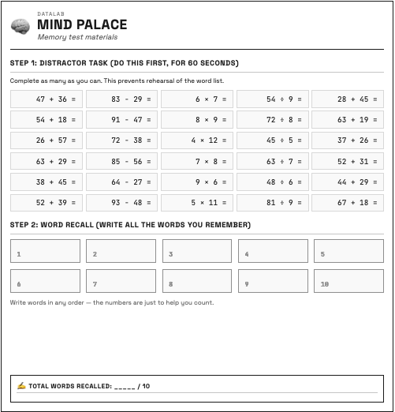
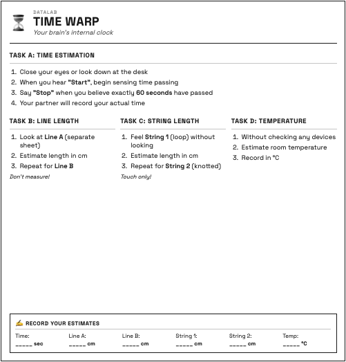
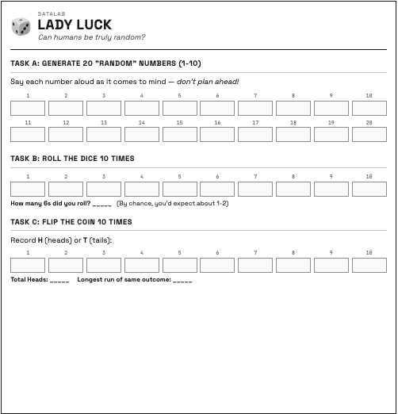
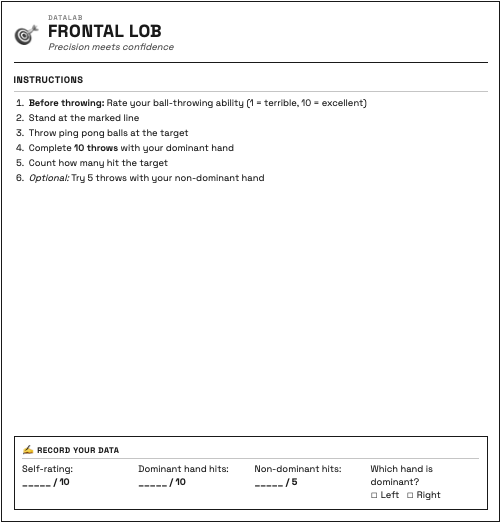

::: {.hero-banner}

# Foundations DataLab {.hero-title}

::: {.subtitle}
PS50008A Research Methods & Experimental Design
:::

::: {.lead}
Explore the results from your hands-on psychology experiments. Analyse real data, discover patterns, and learn statistical techniques through interactive WebR exercises.
:::

:::

## About You {.mt-4}

Before and after the experiments, you completed surveys about your personality, mood, and more. Explore these results:

::: {.stats-grid}

::: {.stat-card .personality}
[**Big 5** Personality & Demographics](pages/personality.qmd)
:::

::: {.stat-card .mood}
[**Pre/Post** Mood Changes](pages/mood.qmd)
:::

:::

---

## Explore the Experiments {.mt-4}

You participated in **6 classic psychology experiments**. Click on any station below to explore the results and analyse the data interactively.

::: {.station-grid}

<a href="pages/memory.qmd" class="station-card memory">

<h3>Memory (Mind Palace)</h3>

Explore the serial position effect and discover how word position affects recall.

</a>

<a href="pages/reflex.qmd" class="station-card reflex">

<h3>Reflex Test</h3>

Analyse reaction times and see if practice makes you faster.

</a>

<a href="pages/timewarp.qmd" class="station-card timewarp">

<h3>Time Warp</h3>

Investigate how accurately we perceive the passage of time.

</a>

<a href="pages/sixthsense.qmd" class="station-card sixthsense">

<h3>Sixth Sense</h3>

Test whether you can detect when someone is looking at you.

</a>

<a href="pages/ladyluck.qmd" class="station-card ladyluck">

<h3>Lady Luck</h3>

Examine how our brains generate (or fail to generate) random numbers.

</a>

<a href="pages/frontallob.qmd" class="station-card frontallob">

<h3>Frontal Lob</h3>

Explore motor lateralisation and the dominant hand advantage.

</a>

:::

---

## Key Findings {.mt-4}

Here's a snapshot of what the data revealed:

::: {.stats-grid}

::: {.stat-card .memory}
::: {.stat-value}
6.2
:::
::: {.stat-label}
Mean words recalled (out of 10)
:::
:::

::: {.stat-card .reflex}
::: {.stat-value}
175ms
:::
::: {.stat-label}
Average reaction time
:::
:::

::: {.stat-card .timewarp}
::: {.stat-value}
55s
:::
::: {.stat-label}
Mean estimate of 60 seconds
:::
:::

::: {.stat-card .sixthsense}
::: {.stat-value}
52%
:::
::: {.stat-label}
Staring detection accuracy
:::
:::

::: {.stat-card .ladyluck}
::: {.stat-value}
2.4
:::
::: {.stat-label}
Most common "random" number
:::
:::

::: {.stat-card .frontallob}
::: {.stat-value}
78%
:::
::: {.stat-label}
Dominant hand accuracy
:::
:::

:::

---

## Teaching Materials {.mt-4}

### Wednesday: Lecture

**"Your Data, Your Discoveries"** - Explore the full results and learn key statistical concepts.

::: {.quick-links}
[View Lecture Slides](slides/lecture.qmd){.quick-link .primary}
[Results Summary](slides/index.qmd){.quick-link}
:::

Topics covered:

- Why distributions aren't always normal
- Pre-post design and paired t-tests
- The music manipulation revealed
- Chance and the null hypothesis
- Metacognition and self-awareness

### Thursday: Lab Activity

**"Analyse Your Own Data"** - Hands-on practice with real data using WebR.

::: {.quick-links}
[Start Lab Activity](lab/index.qmd){.quick-link .primary}
:::

In the lab you will:

1. **Describe & Visualise** - Create histograms, calculate statistics
2. **Test a Hypothesis** - Run t-tests, interpret p-values
3. **Explore a Relationship** - Scatterplots and correlations

---

## About WebR {.mt-4}

::: {.webr-info}

#### Interactive R in Your Browser

The interactive pages use **WebR** - R running directly in your browser with no installation required.

- **No installation needed** - Everything runs in your browser
- **Edit and run code** - Experiment with the R code
- **See results instantly** - Watch visualisations appear in real-time
- **Learn by doing** - Modify code to deepen understanding

:::

::: {.callout-tip collapse="true"}
## Tips for Using WebR Pages

1. **Wait for R to load** - You'll see packages being loaded at the top
2. **Click "Run Code"** - Execute each code block to see results
3. **Modify the code** - Change values, colours, or variables to experiment
4. **Use the "Your Turn!" sections** - Practice writing your own code
:::

---

## Data Files {.mt-4}

The cleaned datasets are available in `data/processed/` for your own analysis:

| File | Description |
|------|-------------|
| `demog_clean.csv` | Demographics and personality measures |
| `memory_clean.csv` | Memory task results (serial position) |
| `task1_reflex_clean.csv` | Reaction time data (5 trials) |
| `task2_timewarp_clean.csv` | Time estimation data |
| `task3_sixthsense_clean.csv` | Staring detection results |
| `task4_ladyluck_clean.csv` | Random number generation |
| `task5_frontallob_clean.csv` | Motor control/throwing data |
| `post_clean.csv` | Post-session feedback |
| `foundations_merged.csv` | All data merged by participant |

---

::: {.key-finding}

#### Ready to Explore?

Jump into any task page to start analysing the data with interactive R code, or head straight to the lab activity for a structured learning experience.

::: {.quick-links}
[Start Lab Activity](lab/index.qmd){.quick-link .primary}
[Memory Task](pages/memory.qmd){.quick-link}
[Reflex Test](pages/reflex.qmd){.quick-link}
:::

:::
