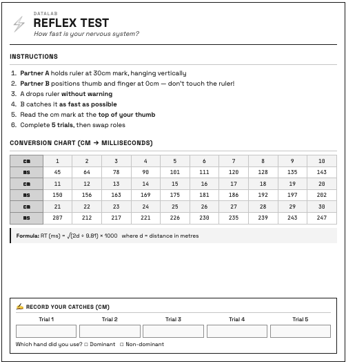

{width="300" fig-align="center"}

## Station Overview

The **Reflex Test** measures how quickly your nervous system can respond to a visual stimulus. Using a simple ruler-drop task, participants catch a falling ruler and convert the distance caught to reaction time in milliseconds. This station demonstrates the **practice effect** — reaction times typically improve across repeated trials.

## What Participants Do

1. **Partner A** holds the ruler at the 30cm mark, letting it hang vertically
2. **Partner B** positions thumb and finger at the 0cm mark — without touching!
3. **Partner A** drops the ruler **without warning** (within 5 seconds)
4. **Partner B** catches it **as fast as possible**
5. Read the distance in cm at the **top of your thumb**
6. Complete **5 trials**, then swap roles

## Research Questions

> Do reaction times improve with practice across 5 trials?

> Is there a difference between dominant and non-dominant hand reaction times?

> Do individual differences (sleep, caffeine) predict reaction time?

## Experimental Design

| Element | Description |
|---------|-------------|
| Design | Within-groups (repeated measures across 5 trials) |
| IV | Trial number (1–5) |
| DV | Reaction time (milliseconds) |
| Controls | Fixed ruler position, same partner dropping |

## Data Variables

| Variable | Type | Description | Range |
|----------|------|-------------|-------|
| `rt_hand` | Categorical | Hand used | Dominant, Non-dominant |
| `rt_trial1_cm` – `rt_trial5_cm` | Continuous | Catch distance per trial | 0–30 cm |
| `rt_missed` | Multi-select | Which trials were missed | Trial 1–5, No misses |

## Calculated Variables

| Variable | Formula | Description |
|----------|---------|-------------|
| `rt_trial1_ms` – `rt_trial5_ms` | √(2d/g) × 1000 | RT in milliseconds |
| `rt_mean_ms` | Average of trials | Mean reaction time |
| `rt_best_ms` | Minimum of trials | Fastest reaction |
| `rt_improvement` | Trial 1 − Trial 5 | Practice effect (positive = improved) |

::: {.callout-note}
## The Physics

Reaction time is calculated using the physics of free fall:

$$RT_{ms} = \sqrt{\frac{2 \times distance_{cm}/100}{9.81}} \times 1000$$

A catch at **15cm ≈ 175ms** reaction time
:::

## Expected Results

| Metric | Typical Range |
|--------|---------------|
| Average RT | 150–250 ms |
| First trial | 180–250 ms |
| Fifth trial | 140–200 ms |
| Improvement | 20–50 ms faster |

::: {.callout-tip}
## Benchmarks
- Under 150ms: Excellent reflexes
- 150–200ms: Above average
- 200–250ms: Average
- Over 250ms: Slower than average
:::

## Suggested Analyses

**Primary analysis:**

- [Paired t-test](../analysis/paired-t-test.qmd) comparing Trial 1 vs Trial 5

**Descriptive statistics:**

- [Mean](../statistics/mean.qmd) and [SD](../statistics/standard-deviation.qmd) across all trials
- Calculate improvement score (Trial 1 − Trial 5)

**Exploratory analyses:**

- Correlate sleep hours with mean RT
- Compare dominant vs non-dominant hand (if both recorded)

## R Code Starter

```r
# Load data
datalab <- read_csv("datalab_data.csv")

# Convert cm to ms using physics formula
cm_to_ms <- function(cm) {
  sqrt(2 * (cm / 100) / 9.81) * 1000
}

# Calculate RT in milliseconds
datalab <- datalab |>
  mutate(
    rt_trial1_ms = cm_to_ms(rt_trial1_cm),
    rt_trial2_ms = cm_to_ms(rt_trial2_cm),
    rt_trial3_ms = cm_to_ms(rt_trial3_cm),
    rt_trial4_ms = cm_to_ms(rt_trial4_cm),
    rt_trial5_ms = cm_to_ms(rt_trial5_cm)
  )

# Mean RT across trials
datalab <- datalab |>
  rowwise() |>
  mutate(rt_mean_ms = mean(c(rt_trial1_ms, rt_trial2_ms, rt_trial3_ms,
                             rt_trial4_ms, rt_trial5_ms), na.rm = TRUE))

# Paired t-test: Trial 1 vs Trial 5
t.test(datalab$rt_trial1_ms, datalab$rt_trial5_ms, paired = TRUE)

# Visualise practice effect
library(tidyr)
library(ggplot2)

datalab |>
  select(participant_id, rt_trial1_ms:rt_trial5_ms) |>
  pivot_longer(cols = -participant_id,
               names_to = "trial",
               values_to = "rt_ms") |>
  mutate(trial = parse_number(trial)) |>
  ggplot(aes(x = trial, y = rt_ms, group = participant_id)) +
  geom_line(alpha = 0.3) +
  geom_smooth(aes(group = 1), method = "lm", se = TRUE, colour = "#275882") +
  labs(x = "Trial", y = "Reaction Time (ms)",
       title = "Practice Effect in Reflex Test")
```

## Connection to Other Concepts

This station demonstrates:

- [Within-Groups Design](../design/within-groups-design.qmd) — same participant across trials
- [Practice Effect](../design/practice-effect.qmd) — improvement through repetition
- [Paired t-test](../analysis/paired-t-test.qmd) — comparing two related measurements

## Tips for Facilitators

- Ensure the ruler is held at exactly 30cm and hangs straight
- Partner A should drop **without warning** but within 5 seconds
- Read the cm mark at the **top of the thumb**, not where fingers touch
- Record any missed catches — these are still informative data
- If equipment issues arise, note them in the comments field
