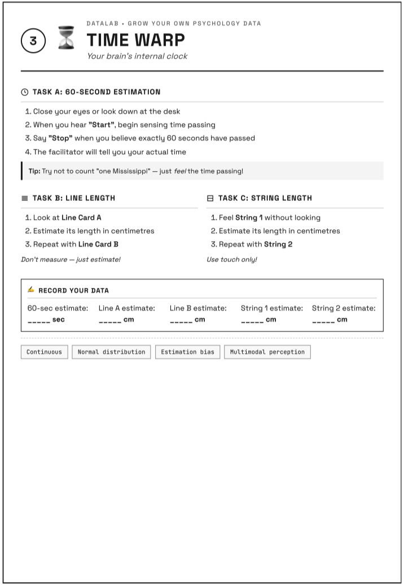
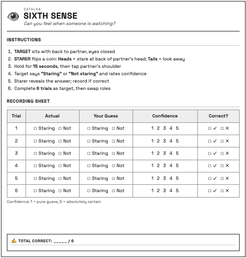
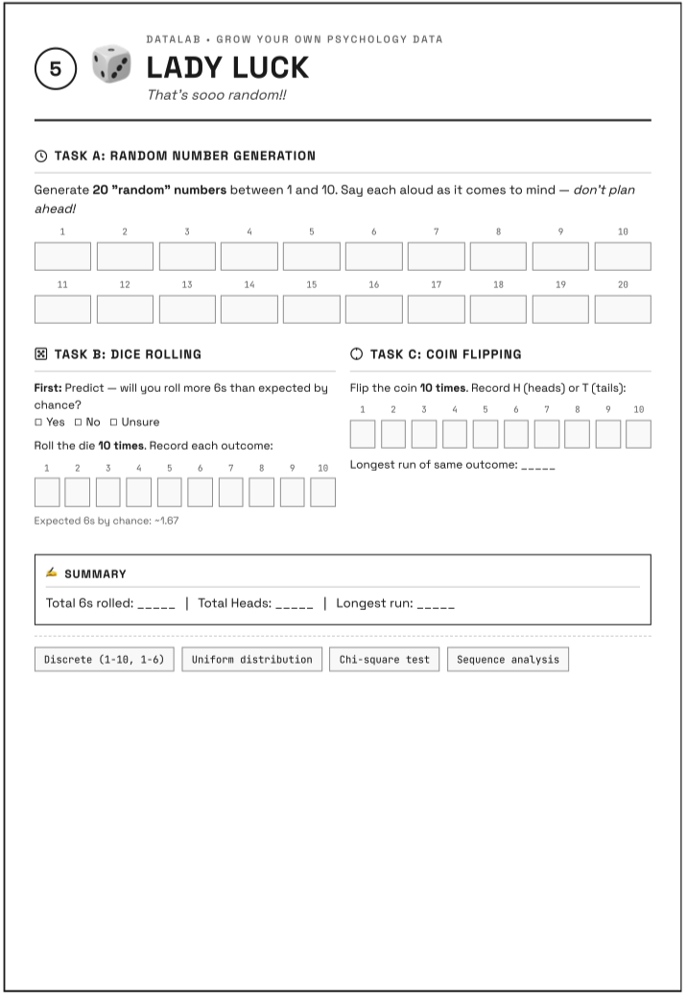
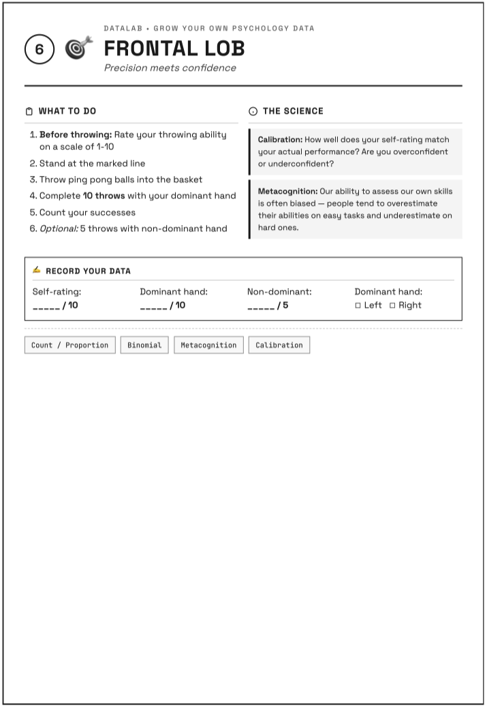

# Welcome to PS50008A {background-color="#275882"}

## Research Methods & Experimental Design {.center}

Your first session of the module

## What is DataLab?

Today you generate the dataset we analyse all term.

- You'll be both **participant** and **tester**
- Work in pairs
- Follow your **sequence card**
- Complete 5 tasks + memory test

## Session Overview

| Time | Activity |
|------|----------|
| 10:00–10:25 | Welcome, Part 1 survey, Memory Test |
| 10:25–11:25 | Complete 5 tasks (follow your sequence card) |
| 11:25–11:35 | Part 2 survey & wrap-up |
| 11:35-11:55 | Data Dictionary preview and discussion |

## What You'll Do

::: {.incremental}
1. Complete Part 1 survey (demographics, mood, personality)
2. Do the **Memory Test** together
3. Follow your **sequence card** through 5 tasks
4. Complete Part 2 survey
:::

# Part 1: Getting Started {background-color="#275882"}

## Get Your Materials

1. Collect your **lab notebook** (with your number)
2. Form into pairs (at least) max group size 4!
3. Collect a sequence card from your lab instructor

## Complete Part 1 Survey

Scan the QR code below or open the link on the VLE:

**[Qualtrics link displayed here]**

Complete:

- Consent
- Sleep & lifestyle
- Current mood
- Personality (TIPI)
- Demographics

# Memory Test {background-color="#4ECDC4"}

## Mind Palace

We do this **together** as a group.

Two word lists on screen:

- **LEFT** = List A
- **RIGHT** = List B

Your instructor tells you which side.

## The Procedure

1. **STUDY** (30 sec) — memorise YOUR list
2. **DISTRACT** (60 sec) — maths problems
3. **RECALL** (90 sec) — write on paper
4. **RECORD** — enter in Qualtrics

## Ready?

Your instructor will say:

**"Look LEFT"** or **"Look RIGHT"**

Have pen and paper ready!

## STUDY: Lab 304A (Mozart) {background-color="#4ECDC4"}

:::: {.columns}
::: {.column width="48%"}
### LEFT

WISDOM

COURAGE

JUSTICE

FREEDOM

PATIENCE

LOYALTY

BEAUTY

SPIRIT

HONOUR

TRUTH
:::
::: {.column width="48%"}
### RIGHT

HOPE

ANGER

FAITH

POWER

GRACE

VIRTUE

DREAM

PEACE

KNOWLEDGE

SOUL
:::
::::



## STUDY: Lab 304B (Silence) {background-color="#4ECDC4"}

:::: {.columns}
::: {.column width="48%"}
### LEFT

APPLE

TABLE

CHAIR

RIVER

MOUNTAIN

GUITAR

CLOCK

PENCIL

FLOWER

BOOK
:::
::: {.column width="48%"}
### RIGHT

WINDOW

RABBIT

JACKET

CANDLE

LADDER

BASKET

HAMMER

PILLOW

GARDEN

BOTTLE
:::
::::



## DISTRACT {background-color="#FF6B6B"}

**Maths problems — no calculator!**

7 × 8 = ?       15 + 27 = ?       64 ÷ 8 = ?

23 − 9 = ?       6 × 9 = ?       81 ÷ 9 = ?

12 + 38 = ?       45 − 17 = ?       8 × 7 = ?



## RECALL {background-color="#6BCB77"}

**Write your words on paper!**

Don't look at the screen.



## Record Results

In Qualtrics, enter:

- Words recalled (0–10)
- Which positions you remembered
- Any intrusions (wrong words)
- Strategy used

# Task Previews {background-color="#275882"}

## The 5 Tasks

Follow your **sequence card**.

Each task: ~15 minutes

Work in pairs — swap roles halfway.

## Task 1: Reflex Test

**How fast is your nervous system?**

- Partner drops ruler without warning
- Catch it as fast as you can
- Record the distance (cm)
- 5 trials each

## Task 2: Time Warp

**How accurate is your internal clock?**

- Estimate when 60 seconds pass
- Estimate line lengths (visual)
- Estimate string lengths (touch only)

## Task 3: Sixth Sense

**Can you detect being watched?**

- Sit back-to-back
- Partner flips coin: stare or look away
- Guess which, rate confidence
- 6 trials each

## Task 4: Lady Luck

**How random can you be?**

- Say 20 "random" numbers (1–10)
- Roll die 10 times
- Flip coin 10 times

## Task 5: Frontal Lob

**How well do you know your ability?**

- Rate your throwing (1–10)
- Throw 10 balls at basket
- Compare prediction to reality

## How Tasks Work

1. Check your **sequence card** for task order
2. Go to that task area
3. Complete with your partner
4. **Enter data in Qualtrics**
5. Move to next task on your card

# Begin Tasks! {background-color="#275882"}

## Check Your Sequence Card

Find your first task.

Go there now with your partner.

## Task Time: 15 minutes {background-color="#FF6B6B"}



## Move to Next Task

Check your sequence card.

Enter data before moving!

## Task Time: 15 minutes {background-color="#A55EEA"}



## Move to Next Task

Check your sequence card.

Enter data before moving!

## Task Time: 15 minutes {background-color="#FFD93D"}



## Move to Next Task

Check your sequence card.

Enter data before moving!

## Task Time: 15 minutes {background-color="#6BCB77"}



## Move to Next Task

Check your sequence card.

Enter data before moving!

## Task Time: 15 minutes (Final) {background-color="#4D96FF"}



# Part 2: Wrap-up {background-color="#275882"}

## Complete Part 2 Survey

Return to Qualtrics:

- Mood NOW (compare to before)
- Favourite task
- Least favourite task
- Comments

## Pre-Post Design

We measured mood **before** and **after**.

This lets us see if DataLab affected how you feel.

Each person is their own control.

# What Did We Learn? {background-color="#275882"}

## Reflex Test {.smaller}

:::: {.columns}
::: {.column width="70%"}
**Physics measures your brain!**

- Distance fallen → reaction time
- Typical: 150–250 milliseconds
- Did you improve across trials?

**What might have affected your data?**

- Ruler height consistency?
- Anticipation of the drop?
- Partner's technique varied?
:::
::: {.column width="30%"}

:::
::::

## Mind Palace {.smaller}

:::: {.columns}
::: {.column width="70%"}
**Working memory in action**

- Miller's "magical number 7 ± 2"
- Serial position effect: primacy & recency
- Distraction task interfered with rehearsal

**What might have affected your data?**

- Could everyone hear clearly?
- Did you use a strategy (chunking)?
- Was the distraction task equally hard?
:::
::: {.column width="30%"}

:::
::::

## Time Warp {.smaller}

:::: {.columns}
::: {.column width="70%"}
**Your brain constructs time**

- Most people over- or under-estimate
- Touch vs vision — which is better?

**What might have affected your data?**

- Did you count in your head?
- When exactly did the stopwatch start?
- Could you see any clocks?
:::
::: {.column width="30%"}

:::
::::

## Sixth Sense {.smaller}

:::: {.columns}
::: {.column width="70%"}
**Can you detect being watched?**

- Chance = 3 out of 6 correct
- Signal detection: hits, misses, false alarms

**What might have affected your data?**

- Peripheral vision leakage?
- Sound cues from your partner?
- Response bias (saying "yes" more)?
:::
::: {.column width="30%"}

:::
::::

## Lady Luck {.smaller}

:::: {.columns}
::: {.column width="70%"}
**Humans are bad at random!**

- We avoid repeating numbers
- Real randomness has streaks
- Gambler's fallacy: coins don't remember

**What might have affected your data?**

- Number preferences (7 is popular!)
- Did you try to "be random"?
- Were dice/coins recorded accurately?
:::
::: {.column width="30%"}

:::
::::

## Frontal Lob {.smaller}

:::: {.columns}
::: {.column width="70%"}
**How well do you know yourself?**

- Calibration = prediction vs reality
- Metacognition: thinking about thinking

**What might have affected your data?**

- How was "success" defined?
- Self-serving bias in ratings?
- Was throwing distance consistent?
:::
::: {.column width="30%"}

:::
::::

## Why This Matters

**Collecting data is hard.**

These challenges are why researchers:

1. Use **standardised procedures**
2. Define variables **operationally**
3. **Train testers** for consistency
4. **Control the environment**

When we analyse your data, we'll consider these factors.

## Data Collected Today

| Task | Variables |
|------|-----------|
| Memory | Words recalled, positions, intrusions |
| Reflex | Reaction times (5 trials) |
| Time Warp | Time, visual, tactile estimates |
| Sixth Sense | Detection accuracy, confidence |
| Lady Luck | Number patterns, dice, coins |
| Frontal Lob | Self-rating, actual performance |
| Pre/Post | Mood, energy, stress |

# Summary {background-color="#275882"}

## What We Did Today

1. Completed surveys (mood, personality)
2. Memory test together
3. 5 tasks as participant and tester
4. Experienced variability firsthand
5. Created pre-post design

## Next Week

**Week 12: Your First Lecture**

Wednesday 10:00–12:00

- Analyse DataLab results together
- Introduction to distributions
- Your data = teaching examples

See you Wednesday!

::: {.notes}
**Facilitator Notes:**
- Check all Qualtrics complete
- Note any issues
- Lab 304A: Mozart + Abstract
- Lab 304B: Silence + Concrete
:::
