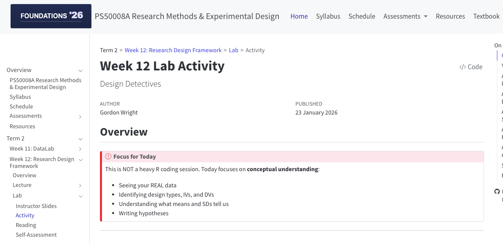

```{r}
#| label: setup
library(tidyverse)
library(knitr)

# Load DataLab data
memory <- read_csv("../../_planning/DATALAB_MATERIALS/data/processed/memory_clean.csv", show_col_types = FALSE)
merged <- read_csv("../../_planning/DATALAB_MATERIALS/data/processed/foundations_merged.csv", show_col_types = FALSE)

# Brand colours
navy <- "#275882"
orange <- "#EA8439"

# Set theme
theme_set(theme_minimal(base_size = 14))
```

# Welcome to Lab {background-color="#275882"}

## Design Detectives

---

## Today's Focus

::: {.objectives-box}
**This is NOT asking you to perform any analysis.** Today is about:

- Seeing YOUR real DataLab data
- Identifying design types, IVs, and DVs
- Understanding what means and SDs tell us
- Writing hypotheses
:::

---

## Lab Structure (~90 min)

| Time | Activity |
|------|----------|
| 10:00-10:10 | These slides + setup |
| 10:10-10:30 | Activity 1: Lab A vs Lab B |
| 10:30-10:50 | Activity 2: Pre-Post Mood |
| 10:50-11:20 | Activity 3: Descriptive Stats |
| 11:20-11:40 | Activity 4: Hypothesis Writing |
| 11:40-12:00 | Activity 5: MCQ Practice |

---

## Open the Activity




*Navigate to: Week 12 > Lab > Activity*

---

# Activity 1: The Big Reveal {background-color="#275882"}

## Lab A vs Lab B (~20 min)

---

## The Hidden Manipulation

::: {.definition-box}
**Lab A** memorised **abstract** words (justice, freedom, wisdom...)

**Lab B** memorised **concrete** words (chair, river, mountain...)

Did it make a difference?
:::

---

## Your Data: Lab A vs Lab B

```{r}
#| label: lab-comparison
#| fig-height: 5
#| fig-align: center
memory_labs <- memory |>
  filter(!is.na(Q11) & !is.na(mem_total_1)) |>
  mutate(Lab = factor(Q11, levels = c(1, 2), labels = c("Lab A\n(Abstract)", "Lab B\n(Concrete)")))

lab_stats <- memory_labs |>
  group_by(Lab) |>
  summarise(
    n = n(),
    Mean = mean(mem_total_1, na.rm = TRUE),
    SD = sd(mem_total_1, na.rm = TRUE)
  )

ggplot(memory_labs, aes(x = Lab, y = mem_total_1, fill = Lab)) +
  geom_boxplot(alpha = 0.4, outlier.shape = NA, width = 0.5) +
  geom_jitter(aes(colour = Lab), width = 0.15, size = 3, alpha = 0.7) +
  stat_summary(fun = mean, geom = "point", shape = 18, size = 5, colour = "black") +
  scale_fill_manual(values = c(navy, orange)) +
  scale_colour_manual(values = c(navy, orange)) +
  labs(x = NULL, y = "Words Recalled (out of 10)",
       title = "Memory Performance by Lab",
       subtitle = "Black diamonds = group means") +
  theme(legend.position = "none",
        plot.title = element_text(hjust = 0.5, size = 18, face = "bold"),
        plot.subtitle = element_text(hjust = 0.5, colour = "gray50"))
```

---

## Key Questions to Emphasise

Ask students:

1. **What did the researcher MANIPULATE?** (Word type)
2. **What did the researcher MEASURE?** (Recall)
3. **Same people or different people?** (Different)
4. **Design type?** (Between-subjects)

---

## The Key Insight

::: {.callout-important}
## Between-Subjects

Different people in Lab A vs Lab B.

We're comparing **between** groups.
:::

---

# Activity 2: Pre-Post Mood {background-color="#275882"}

## Same Person, Different Conditions (~20 min)

---

## Your Data: Mood Before vs After

```{r}
#| label: mood-change
#| fig-height: 5
#| fig-align: center
mood_data <- merged |>
  select(participant_id, mood_pre_1, post_mood_post_1) |>
  filter(!is.na(mood_pre_1) & !is.na(post_mood_post_1)) |>
  mutate(change = post_mood_post_1 - mood_pre_1)

mood_long <- mood_data |>
  pivot_longer(cols = c(mood_pre_1, post_mood_post_1),
               names_to = "Time", values_to = "Mood") |>
  mutate(Time = factor(Time, levels = c("mood_pre_1", "post_mood_post_1"),
                       labels = c("Before", "After")))

ggplot(mood_long, aes(x = Time, y = Mood, fill = Time)) +
  geom_boxplot(alpha = 0.4, outlier.shape = NA, width = 0.5) +
  geom_jitter(aes(colour = Time), width = 0.1, size = 2, alpha = 0.6) +
  geom_line(data = mood_data |>
              pivot_longer(cols = c(mood_pre_1, post_mood_post_1),
                          names_to = "Time", values_to = "Mood") |>
              mutate(Time = factor(Time, levels = c("mood_pre_1", "post_mood_post_1"),
                                  labels = c("Before", "After"))),
            aes(group = participant_id), alpha = 0.3, colour = "gray40") +
  stat_summary(fun = mean, geom = "point", shape = 18, size = 5, colour = "black") +
  scale_fill_manual(values = c(navy, orange)) +
  scale_colour_manual(values = c(navy, orange)) +
  labs(x = NULL, y = "Mood Rating (1-10)",
       title = "Mood Before vs After DataLab",
       subtitle = "Lines connect the SAME PERSON") +
  theme(legend.position = "none",
        plot.title = element_text(hjust = 0.5, size = 18, face = "bold"),
        plot.subtitle = element_text(hjust = 0.5, colour = "gray50"))
```

---

## Key Point

::: {.definition-box}
The **faint lines connect the same person**.

This is what makes it a within-subjects design!
:::

---

## Questions to Emphasise

1. **Same people or different?** (Same)
2. **Design type?** (Within-subjects)
3. **Why is this powerful?** (Each person is their own control)

---

# Activity 3: Descriptive Statistics {background-color="#275882"}

## Understanding Mean and SD (~30 min)

---

## Same Mean, Different Spread

```{r}
#| label: spread-demo
#| fig-height: 4.5
#| fig-align: center
set.seed(42)
spread_data <- tibble(
  Group = rep(c("Group A\n(Clustered)", "Group B\n(Spread Out)"), each = 20),
  Score = c(rnorm(20, 6, 0.8), rnorm(20, 6, 2.5))
)

spread_stats <- spread_data |>
  group_by(Group) |>
  summarise(Mean = round(mean(Score), 2), SD = round(sd(Score), 2))

ggplot(spread_data, aes(x = Group, y = Score, colour = Group)) +
  geom_jitter(width = 0.15, size = 4, alpha = 0.8) +
  geom_hline(yintercept = 6, linetype = "dashed", colour = "gray40", linewidth = 1) +
  stat_summary(fun = mean, geom = "point", shape = 18, size = 6, colour = "black") +
  scale_colour_manual(values = c(navy, orange)) +
  annotate("text", x = 2.5, y = 6.2, label = "Same Mean ≈ 6", colour = "gray40", size = 5) +
  labs(y = "Score", x = NULL,
       title = "Same Mean, Different Spread",
       subtitle = paste0("Group A: SD = ", spread_stats$SD[1], " | Group B: SD = ", spread_stats$SD[2])) +
  theme(legend.position = "none",
        plot.title = element_text(hjust = 0.5, size = 18, face = "bold"),
        plot.subtitle = element_text(hjust = 0.5, colour = "gray50"))
```

::: {.callout-note}
**The mean alone doesn't tell the whole story!**
:::

---

## Reading R Output

Students will see actual R code output:

```r
mean(scores)
[1] 7

sd(scores)
[1] 1.195229

summary(scores)
   Min. 1st Qu.  Median    Mean 3rd Qu.    Max.
   5.00    6.00    7.00    7.00    8.00    9.00
```

**Task**: Identify what each number means.

---

## Signal vs Noise

::: {.definition-box}
**Signal** = difference between group means

**Noise** = variability within groups (SD)

A difference only matters if it's **big relative to the SD**!
:::

---

# Activity 4: Hypothesis Writing {background-color="#275882"}

## Practice (~20 min)

---

## Key Distinctions

| Type | Predicts |
|------|----------|
| Experimental (H₁) | There WILL be an effect |
| Null (H₀) | There will be NO effect |
| One-tailed | Direction of effect |
| Two-tailed | Difference, not direction |

---

## Example

::: {.example-box}
**One-tailed**: "Concrete words will be recalled **better** than abstract words"

**Two-tailed**: "Word type will **affect** memory"
:::

---

# Activity 5: MCQ Practice {background-color="#275882"}

## Putting It Together (~20 min)

---

## Three Investigations

1. **Throwing Accuracy** (dominant vs non-dominant hand) — Within-subjects
2. **Self-Rating vs Performance** — Correlational (no IV!)
3. **Sixth Sense** — vs Chance

Students apply what they've learned.

---

# Wrap-Up {background-color="#275882"}

---

## Key Takeaways

**Design Types:**

- **Between-subjects** = Different people in each condition
- **Within-subjects** = Same people in all conditions
- **Correlational** = No manipulation, measuring relationships

---

## Key Takeaways

**Variables:**

- **IV** = What the researcher manipulates
- **DV** = What the researcher measures
- Correlational designs have **NO IV**

---

## Next Steps

Direct students to:

1. Complete the **Week 12 Self-Assessment Quiz**
2. Review the **Lecture Reading**
3. Start thinking about **Research Plan** (due Week 16)

---

# Questions? {background-color="#275882"}

## Then let's begin the activity!

::: {.notes}
Instructor slides complete. Approximately 10 minutes of introduction before moving to hands-on activity. Walk around and help students as they work through each section.
:::
