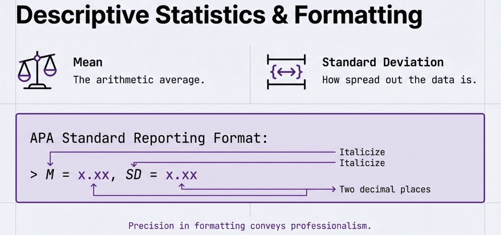
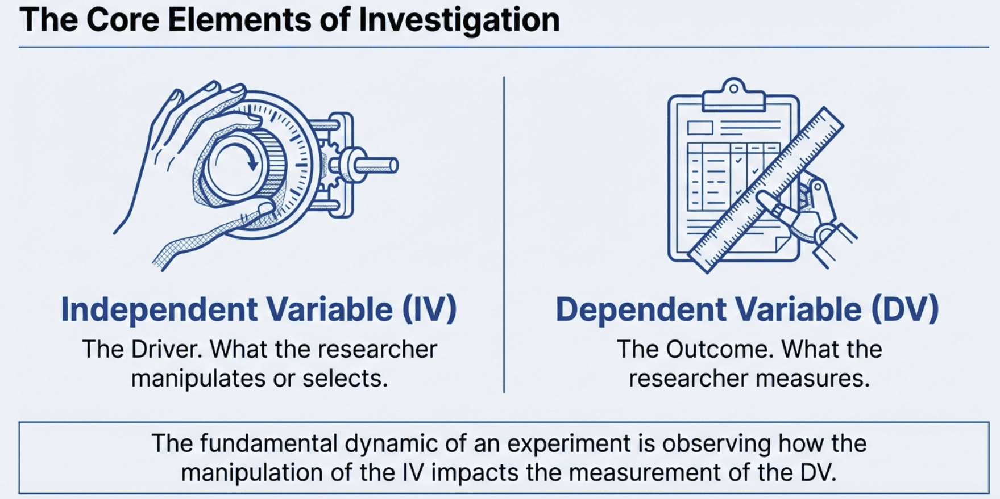
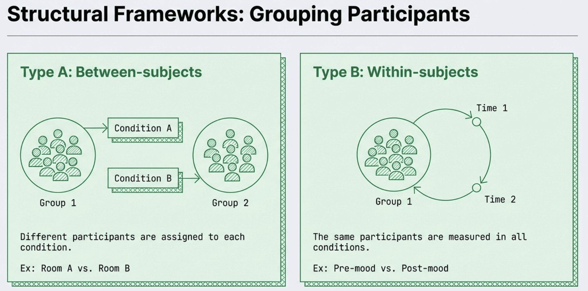
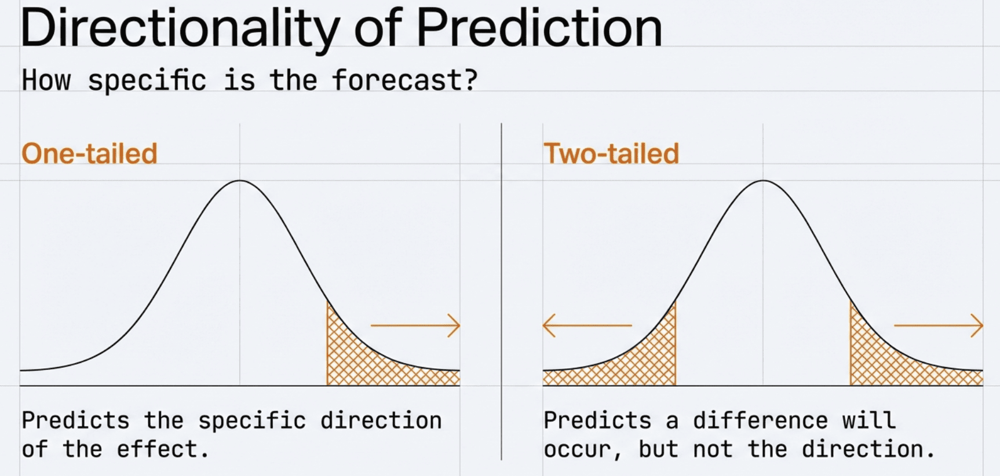
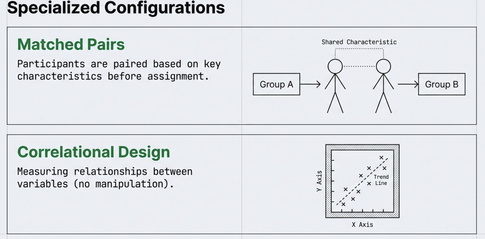
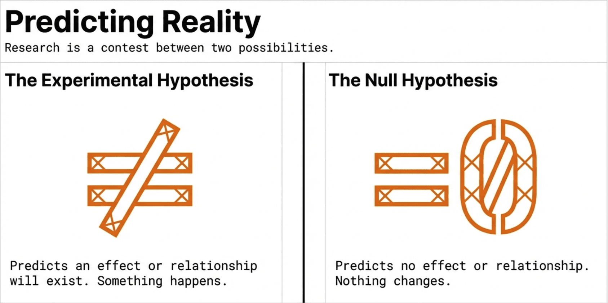
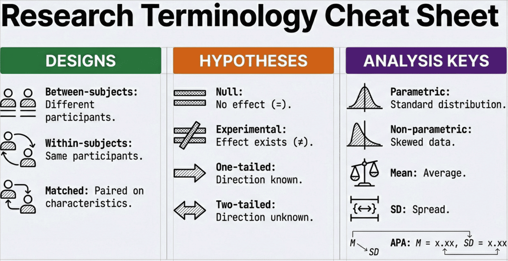

```{r}
#| label: setup
#| include: false
library(tidyverse)
library(knitr)

# Load DataLab data
memory <- read_csv("data/memory_clean.csv", show_col_types = FALSE)
merged <- read_csv("data/foundations_merged.csv", show_col_types = FALSE)
sixthsense <- read_csv("data/task3_sixthsense_clean.csv", show_col_types = FALSE)
frontallob <- read_csv("data/task5_frontallob_clean.csv", show_col_types = FALSE)
ladyluck <- read_csv("data/task4_ladyluck_clean.csv", show_col_types = FALSE)

# Set theme
theme_set(theme_minimal(base_size = 18))

# Brand colours
navy <- "#275882"
orange <- "#EA8439"
```

# Welcome to Week 12 {background-color="#275882"}

## Who Are We?

:::: {.columns}

::: {.column width="50%"}
**Dr Gordon Wright**

Module Coordinator

Research: Social cognition, deception, dark personalities and interpersonal perception

Office hours: Thursdays 12:00-13:00
:::

::: {.column width="50%"}
**Dr Bence Palfi**

Lecturer in the department and our second Lab instructor

Research: AI, Human-Computer Interactions, Meta-Science

:::

::::

## What Is This Module?

**Research Methods & Experimental Design**

How psychologists:

- Ask questions about the mind and behaviour
- Design studies to answer those questions
- Collect and analyse data
- Draw valid conclusions

::: {.notes}
Emphasise this is a practical, skills-based module.
Not just theory — they will DO research.
:::

# Why Research Methods? {.center}

## The Problem with Common Sense

::: {.incremental}

- "Opposites attract"
- "Birds of a feather flock together"
- Both can't be true... can they?

:::

::: {.fragment}
::: {.concept-box}
Common sense often gives contradictory answers. Science provides a systematic way to find out what's actually true.
:::
:::

## Everyday Thinking vs Scientific Thinking

:::: {.columns}

::: {.column width="50%"}
**Everyday Thinking**

- Based on personal experience
- Influenced by biases
- Accepts anecdotes as evidence
- Confirmation bias
- "I just know"
:::

::: {.column width="50%"}
**Scientific Thinking**

- Based on systematic observation
- Controls for biases
- Requires replicable evidence
- Seeks disconfirmation
- "Let's test it"
:::

::::

## Why Should You Care?

::: {.incremental}

- Evaluate claims you encounter daily
- Understand how psychological knowledge is created
- Essential for your dissertation
- Transferable skills for any career
- Required for postgraduate study

:::

# The Research Process {.center}

## From Question to Knowledge

```{mermaid}
%%| echo: false
flowchart LR
    Q[Research Question] --> H[Hypothesis]
    H --> D[Design Study]
    D --> C[Collect Data]
    C --> A[Analyse Data]
    A --> I[Interpret Results]
    I --> Q
```

## Step 1: The Research Question

Where do research questions come from?

- Curiosity about behaviour
- Gaps in existing research
- Real-world problems
- Theory testing
- Unexpected observations

::: {.fragment}
**Example:** Do people lie more when texting than face-to-face?
:::

## Step 2: The Hypothesis

::: {.concept-box}
A **hypothesis** is a specific, testable prediction about what you expect to find.
:::

**Good hypothesis:**

> "Participants will tell more lies per conversation when communicating via text message compared to face-to-face."

**Not a hypothesis:**

> "I wonder if texting affects lying."

## Step 3: Design the Study

Key decisions:

- Who will you study? (participants)
- What will you measure? (variables)
- How will you measure it? (methods)
- What comparisons will you make? (design)

::: {.fragment}
We'll spend most of this module on this step.
:::

## Step 4: Collect Data

- Follow your plan precisely
- Treat participants ethically
- Record everything carefully
- Minimise errors and bias

## Step 5: Analyse Data

::: {.concept-box}
**Statistics** are tools for finding patterns in data and determining whether those patterns are meaningful.
:::

This is where **R** comes in — and what you'll learn in the labs.

## Step 6: Interpret Results

- What do the findings mean?
- Do they support the hypothesis?
- What are the limitations?
- What questions remain?

::: {.fragment}
Then the cycle continues...
:::

# What You'll Learn {.center}

## Project Timeline

| Week | Milestone |
|------|-----------|
| 11 | See how much fun collecting data is! |
| 12-15 | Develop research question and design |
| — | *Reading Week* — Work on Research Plan |
| 16 | **Research Plan due**; Begin data collection |
| 17-18 | Data collection and initial analysis |
| 19-20 | Complete analysis; Develop write-up (term ends) |
| Spring Break | Individual report writing |
| Post-term | **Research Report due** mid-late April (date TBC) |

## Lectures vs Labs

:::: {.columns}

::: {.column width="50%"}
**Lectures (Wednesday 10-12 from week 12)**

- Concepts and theory
- Research design principles
- How to think about data
:::

::: {.column width="50%"}
**Labs (Thursday 10-12)**

- Working with real data
- Building practical skills
- Applying design principles
- Learning about statistical test with R
:::

::::

::: {.fragment}
They work together — lecture concepts, lab application.
:::

## Why R? (nothing to fear!)

::: {.incremental}

- Free and open source
- Industry standard in data science
- Powerful data analysis and visualisation
- Reproducible research
- Employable skill

:::

::: {.fragment}
::: {.callout-note}
## No Experience Required
We assume you've never programmed before. We start from zero.
:::
:::

## Assessment Overview

Find an [overview](../../assessments.qmd) here

| Assessment | Weight | Deadline | Week |
|------------|--------|----------|:----:|
| [Research Plan](../../assessments/research-plan.qmd) | 20% | Fri 27 Feb 2026, 12 noon | 16 |
| [MCQ Exam](../../assessments/mcq-exam.qmd) | 20% | Wed 11 Mar 2026, in lecture slot | 18 |
| [EDS Assignment](../../assessments/eds-assignment.qmd) | 20% | Fri 20 Mar 2026, 12 noon | 20 |
| [Research Report](../../assessments/research-report.qmd) | 40% | Mid-late April 2026, 12 noon (date TBC) | Post-term |

## Before We Begin

::: {.callout-tip}
## Bookmark These

- **Glossary** — Look up any unfamiliar terms
- **Self-Assessment Quizzes** — Check your understanding
- **Textbook Chapters** — Go deeper on any topic
- **Hypothes.is** — Ask questions, see classmates' annotations
- **Assessment 1 Guidance** — Start here for your Research Plan
:::

## Your data tell a story — let's learn how to read it

------------------------------------------------------------------------

## Today's Learning Objectives

::: objectives-box
By the end of this lecture, you will be able to:

-   Identify **Independent Variables (IV)** and **Dependent Variables (DV)** in any study
-   Distinguish between **between-subjects**, **within-subjects**, and **correlational** designs
-   Write **one-tailed** and **two-tailed** hypotheses
-   Calculate and interpret **mean** and **standard deviation**
:::

------------------------------------------------------------------------

## The Big Idea

::: callout-important
## Critical Week

Today introduces **ALL** the terminology you need for your Research Plan.

Everything connects: Research Question → Variables → Design → Hypothesis
:::

# Act 1: What Are Data? {background-color="#275882"}

## You generated these data (15 min)

## What Did You Actually Do Last Week?

You completed **6 tasks** plus pre/post surveys:

1.  **Memory Test** (Mind Palace)
2.  **Reflex Test** (Ruler catch)
3.  **Time Warp** (60 second estimation)
4.  **Sixth Sense** (Staring detection)
5.  **Lady Luck** (Random numbers)
6.  **Frontal Lob** (Throwing accuracy)

. . .

**Each task generated NUMBERS** — and numbers are what we analyse!

## You Are a Data Point - a datum

```{r}
#| label: you-are-here
#| fig-height: 5
#| fig-align: center
memory_plot <- memory |>
  filter(!is.na(mem_total_1))

ggplot(memory_plot, aes(x = "", y = mem_total_1)) +
  geom_jitter(width = 0.25, size = 5, alpha = 0.7, color = navy) +
  labs(x = NULL, y = "Words Recalled (out of 10)",
       title = "Memory Scores — Each Dot Is One Person") +
  theme(axis.text.x = element_blank(),
        plot.title = element_text(hjust = 0.5, size = 22))
```

::: fragment
**Can you spot yourself?**
:::

# Act 2: What's Typical? {background-color="#275882"}

## The simplest question (20 min)

## When You Have Numbers, You Want to Know: What's Normal?

```{r}
#| label: memory-histogram
#| fig-height: 4.5
#| fig-align: center
ggplot(memory_plot, aes(x = mem_total_1)) +
  geom_histogram(binwidth = 1, fill = navy, color = "white", alpha = 0.8) +
  labs(x = "Words Recalled (out of 10)", y = "Number of People",
       title = "Distribution of Memory Scores") +
  scale_x_continuous(breaks = 0:10) +
  theme(plot.title = element_text(hjust = 0.5))
```

. . .

The **histogram** shows how many people got each score.

## The Mean: What's Average?

::: definition-box
**Mean** ($\bar{x}$) = Sum of all values ÷ Number of values

$$\bar{x} = \frac{\sum x_i}{n}$$
:::

```{r}
#| label: mean-calc
mean_mem <- round(mean(memory_plot$mem_total_1, na.rm = TRUE), 1)
```

## That's what I mean!

```{r}

#| label: memory-histogram
#| fig-height: 4.5
#| fig-align: center

memory_mean <- mean(memory_plot$mem_total_1, na.rm = TRUE)

ggplot(memory_plot, aes(x = mem_total_1)) +
  geom_histogram(binwidth = 1, fill = navy, color = "white", alpha = 0.8) +
  geom_vline(xintercept = memory_mean, linetype = "dashed", color = "red", linewidth = 1.2) +
  annotate("text", x = memory_mean + 0.3, y = Inf, vjust = 2, hjust = 0,
           label = paste0("Mean = ", round(memory_mean, 1)), color = "red", fontface = "bold") +
  labs(x = "Words Recalled (out of 10)", y = "Number of People",
       title = "Distribution of Memory Scores") +
  scale_x_continuous(breaks = 0:10) +
  theme(plot.title = element_text(hjust = 0.5))

```

. . .

For your memory scores: **Mean = `r mean_mem` words**

## But Wait... Same Mean, Different Stories

```{r}
#| label: spread-demo
#| fig-height: 4.5
#| fig-align: center
set.seed(42)
spread_data <- tibble(
  Group = rep(c("Group A: Clustered", "Group B: Spread Out"), each = 15),
  Score = c(rnorm(15, 6, 0.8), rnorm(15, 6, 2.5))
)

ggplot(spread_data, aes(x = Group, y = Score, color = Group)) +
  geom_jitter(width = 0.15, size = 4, alpha = 0.8) +
  geom_hline(yintercept = 6, linetype = "dashed", color = "gray40", linewidth = 1) +
  scale_color_manual(values = c(navy, orange)) +
  labs(y = "Score", title = "Same Mean (~6), Different Spread") +
  annotate("text", x = 2.5, y = 6.3, label = "Mean ≈ 6", color = "gray40", size = 5) +
  theme(legend.position = "none",
        plot.title = element_text(hjust = 0.5))
```

. . .

**Same mean, but Group B is much more variable!**

## We Need to Measure Spread

::: definition-box
**Standard Deviation (SD)** = How spread out the data are from the mean
:::

```{r}
#| label: sd-calc
sd_mem <- round(sd(memory_plot$mem_total_1, na.rm = TRUE), 2)
```

-   **Low SD** = Scores clustered together (consistent)
-   **High SD** = Scores spread out (variable)

. . .

For your memory scores: **SD = `r sd_mem` words**

## The Key Insight

::: callout-important
## Remember This

A **difference between means** only matters if it's **big relative to the spread**.

-   **Signal** = difference between means
-   **Noise** = variability within groups
-   The question: Is the signal **bigger** than the noise?
:::

{fig-align="center"}

# Act 3: The Big Reveal {background-color="#275882"}

## Lab A vs Lab B (25 min)

## There Was a Hidden Manipulation

Last week you did the **Memory Test** (Mind Palace).

. . .

But here's what you didn't know...

. . .

::: callout-warning
## The Secret

**Lab A** and **Lab B** saw **different words**!
:::

## The Manipulation

::::: columns
::: {.column width="50%"}
**Lab A (Gordon)**

Memorised **abstract** words:

-   Justice
-   Freedom
-   Wisdom
-   Courage
-   Truth
:::

::: {.column width="50%"}
**Lab B (Bence)**

Memorised **concrete** words:

-   Chair
-   River
-   Mountain
-   Apple
-   Hammer
:::
:::::

## Let's See the Results!

```{r}
#| label: memory-by-lab
#| fig-height: 5
#| fig-align: center
# Q11: 1 = Lab A (abstract), 2 = Lab B (concrete)
memory_labs <- memory |>
  filter(!is.na(Q11) & !is.na(mem_total_1)) |>
  mutate(Lab = factor(Q11, levels = c(1, 2),
                      labels = c("Lab A\n(Abstract)", "Lab B\n(Concrete)")))

ggplot(memory_labs, aes(x = Lab, y = mem_total_1, fill = Lab)) +
  geom_boxplot(alpha = 0.6, outlier.shape = NA, width = 0.5) +
  geom_jitter(width = 0.15, size = 4, alpha = 0.7) +
  scale_fill_manual(values = c(navy, orange)) +
  labs(x = NULL, y = "Words Recalled (out of 10)",
       title = "Memory Performance by Lab") +
  theme(legend.position = "none",
        plot.title = element_text(hjust = 0.5, size = 22))
```

## The Numbers

```{r}
#| label: lab-stats
lab_stats <- memory_labs |>
  group_by(Lab) |>
  summarise(
    n = n(),
    Mean = round(mean(mem_total_1, na.rm = TRUE), 1),
    SD = round(sd(mem_total_1, na.rm = TRUE), 2)
  )
```

| Lab   | Word Type | n                  | Mean                  | SD                  |
|---------------|---------------|---------------|---------------|---------------|
| Lab A | Abstract  | `r lab_stats$n[1]` | `r lab_stats$Mean[1]` | `r lab_stats$SD[1]` |
| Lab B | Concrete  | `r lab_stats$n[2]` | `r lab_stats$Mean[2]` | `r lab_stats$SD[2]` |

. . .

**Difference**: `r round(lab_stats$Mean[2] - lab_stats$Mean[1], 1)` words

. . .

Is this difference **real** or just **chance**?

. . .

Join us in week 14 and we will put that to the **t-test**!

## Now Let's Introduce the Terminology

::: definition-box
**Independent Variable (IV)**: What the researcher **manipulates** or controls

**Dependent Variable (DV)**: What the researcher **measures** — the outcome
:::

{fig-align="center"}

. . .

In the memory experiment:

-   **IV** = Word type (abstract vs concrete)
-   **DV** = Number of words recalled (0-10)

## Design Type: Between-Subjects

::: definition-box
**Between-subjects design**: Different participants in each condition
:::

{fig-align="center"}

. . .

-   Lab A people **only** saw abstract words
-   Lab B people **only** saw concrete words
-   You couldn't be in **both** labs!

. . .

Why? **Between** = different people in each group

## Writing a Hypothesis

::: definition-box
**Experimental hypothesis (H₁)**: Predicts an effect or difference

**Null hypothesis (H₀)**: Predicts no effect or no difference
:::

. . .

For the memory experiment:

-   **H₁**: Concrete words will be easier to remember than abstract words
-   **H₀**: There will be no difference in recall between word types

## One-Tailed vs Two-Tailed

::: definition-box
**One-tailed**: Predicts the **direction** of the effect

**Two-tailed**: Predicts a difference but **not** which direction
:::

. . .

-   **One-tailed**: "Concrete words will be **better** than abstract" (predicts direction)
-   **Two-tailed**: "Word type will **affect** memory" (no direction)

{fig-align="center" width="840"}

# Act 4: Same Person, Different Conditions {background-color="#275882"}

## Within-subjects design (20 min)

## The Pre-Post Mood Survey

Remember you rated your **mood** at the start AND end of the session?

```{r}
#| label: mood-data
#| fig-height: 4.5
#| fig-align: center
mood_data <- merged |>
  select(participant_id, mood_pre_1, post_mood_post_1) |>
  filter(!is.na(mood_pre_1) & !is.na(post_mood_post_1)) |>
  pivot_longer(cols = c(mood_pre_1, post_mood_post_1),
               names_to = "Time", values_to = "Mood") |>
  mutate(Time = factor(Time, levels = c("mood_pre_1", "post_mood_post_1"),
                       labels = c("Before", "After")))

ggplot(mood_data, aes(x = Time, y = Mood, fill = Time)) +
  geom_boxplot(alpha = 0.6, width = 0.5) +
  geom_jitter(width = 0.1, size = 3, alpha = 0.5) +
  scale_fill_manual(values = c(navy, orange)) +
  labs(x = NULL, y = "Mood Rating (1-10)",
       title = "Mood Before vs After the Session") +
  theme(legend.position = "none",
        plot.title = element_text(hjust = 0.5))
```

## This Is Within-Subjects Design

::: definition-box
**Within-subjects design**: The **same participants** measured in **all conditions**
:::

. . .

-   Pre-mood and post-mood came from **the same person**
-   You're being compared **to yourself**

## Why Is This Powerful?

::: callout-tip
## The Power of Within-Subjects

Each person is their own **control**!
:::

. . .

Individual differences are **controlled**:

-   If your pre-mood was 5 and post-mood was 7...
-   **You** improved by 2 points
-   We don't need to worry about other people's baseline moods

# Act 5: Relationships, Not Differences {background-color="#275882"}

## Correlational design (15 min)

## Self-Rating vs Actual Performance

Before the throwing task, you **rated** how good you thought you'd be.

**Question**: Do people know themselves?

```{r}
#| label: self-rating
#| fig-height: 4.5
#| fig-align: center
throw_data <- frontallob |>
  filter(!is.na(throw_self_rating_1) & !is.na(throw_dom_success)) |>
  mutate(accuracy = throw_dom_success / 10 * 100)

if(nrow(throw_data) > 3) {
  ggplot(throw_data, aes(x = throw_self_rating_1, y = accuracy)) +
    geom_point(size = 5, color = navy, alpha = 0.7) +
    geom_smooth(method = "lm", se = FALSE, color = orange, linewidth = 2) +
    labs(x = "Self-Rating (1-10)", y = "Actual Accuracy (%)",
         title = "Do People Know Themselves?") +
    scale_x_continuous(breaks = 1:10) +
    theme(plot.title = element_text(hjust = 0.5))
} else {
  # Simulated data if real data insufficient
  set.seed(123)
  sim_throw <- tibble(
    rating = sample(3:9, 25, replace = TRUE),
    accuracy = rating * 8 + rnorm(25, 0, 15)
  )
  ggplot(sim_throw, aes(x = rating, y = accuracy)) +
    geom_point(size = 5, color = navy, alpha = 0.7) +
    geom_smooth(method = "lm", se = FALSE, color = orange, linewidth = 2) +
    labs(x = "Self-Rating (1-10)", y = "Actual Accuracy (%)",
         title = "Do People Know Themselves?") +
    theme(plot.title = element_text(hjust = 0.5))
}
```

## This Is Correlational Design

::: definition-box
**Correlational design**: Measuring the **relationship** between two variables — **no manipulation**
:::

. . .

-   **Variable 1**: Self-rating (1-10)
-   **Variable 2**: Actual accuracy (%)

. . .

::: callout-warning
## Key Point

There is **no IV** in a correlational design!
:::

## The Critical Warning

::: callout-warning
## Say It With Me

**Correlation ≠ Causation**

Finding a relationship does NOT mean one variable **causes** the other.
:::

. . .

Even if self-ratings predict performance, we can't say self-ratings **cause** good performance.

{fig-align="center" width="1008"}

# Act 6: Was It Just Luck? {background-color="#275882"}

## The null hypothesis (20 min)

{fig-align="center" width="1200"}

## The Sixth Sense Task

You tried to detect if someone was staring at you.

-   6 trials
-   Guessed "staring" or "not staring"

. . .

**If you're just guessing**: You'd expect **3 out of 6** right (50%)

## Your Results

```{r}
#| label: sixth-sense
#| fig-height: 4.5
#| fig-align: center
# Calculate accuracy for each participant
stare_cols <- c("stare_t1_actual", "stare_t1_guess",
                "stare_t2_actual", "stare_t2_guess",
                "stare_t3_actual", "stare_t3_guess",
                "stare_t4_actual", "stare_t4_guess",
                "stare_t5_actual", "stare_t5_guess",
                "stare_t6_actual", "stare_t6_guess")

if(all(stare_cols %in% names(sixthsense))) {
  accuracy_data <- sixthsense |>
    mutate(
      correct1 = (stare_t1_actual == stare_t1_guess),
      correct2 = (stare_t2_actual == stare_t2_guess),
      correct3 = (stare_t3_actual == stare_t3_guess),
      correct4 = (stare_t4_actual == stare_t4_guess),
      correct5 = (stare_t5_actual == stare_t5_guess),
      correct6 = (stare_t6_actual == stare_t6_guess),
      n_correct = correct1 + correct2 + correct3 + correct4 + correct5 + correct6
    ) |>
    filter(!is.na(n_correct))

  ggplot(accuracy_data, aes(x = factor(n_correct))) +
    geom_bar(fill = navy, alpha = 0.8) +
    geom_vline(xintercept = 3.5, linetype = "dashed", color = orange, linewidth = 2) +
    labs(x = "Number Correct (out of 6)", y = "Number of People",
         title = "Sixth Sense Accuracy") +
    annotate("text", x = 5, y = max(table(accuracy_data$n_correct)) * 0.8,
             label = "Chance = 3", color = orange, size = 6) +
    theme(plot.title = element_text(hjust = 0.5))
} else {
  # Simulated data
  set.seed(456)
  sim_sixth <- tibble(n_correct = rbinom(30, 6, 0.5))
  ggplot(sim_sixth, aes(x = factor(n_correct))) +
    geom_bar(fill = navy, alpha = 0.8) +
    geom_vline(xintercept = 3.5, linetype = "dashed", color = orange, linewidth = 2) +
    labs(x = "Number Correct (out of 6)", y = "Number of People",
         title = "Sixth Sense Accuracy") +
    annotate("text", x = 5, y = 8, label = "Chance = 3", color = orange, size = 6) +
    theme(plot.title = element_text(hjust = 0.5))
}
```

## Some People Got 5/6 or 6/6!

::: callout-note
## The Question

Does getting 5 or 6 right mean you have a **sixth sense**?
:::

. . .

**Not necessarily!**

. . .

If you flip a coin 6 times, sometimes you get 5 or 6 heads **just by luck**.

## The Null Hypothesis

::: definition-box
**Null hypothesis (H₀)**: The result is due to **chance**, not a real effect.
:::

. . .

For the sixth sense:

-   **H₀**: People are just guessing (performance = 50%)
-   **H₁**: People can detect staring (performance ≠ 50%)

## Your Dice Rolls

```{r}
#| label: dice-rolls
#| fig-height: 4.5
#| fig-align: center
# Get dice roll data
dice_cols <- paste0("dice_rolls_", 1:10)
if(all(dice_cols %in% names(ladyluck))) {
  dice_data <- ladyluck |>
    select(all_of(dice_cols)) |>
    pivot_longer(everything(), values_to = "roll") |>
    filter(!is.na(roll))

  expected <- nrow(dice_data) / 6

  ggplot(dice_data, aes(x = factor(roll))) +
    geom_bar(fill = navy, alpha = 0.8) +
    geom_hline(yintercept = expected, linetype = "dashed", color = orange, linewidth = 1.5) +
    labs(x = "Dice Roll", y = "Count",
         title = "Your Dice Rolls — Are They Fair?") +
    annotate("text", x = 5.5, y = expected + 2, label = "Expected if fair",
             color = orange, size = 5) +
    theme(plot.title = element_text(hjust = 0.5))
} else {
  set.seed(789)
  sim_dice <- tibble(roll = sample(1:6, 60, replace = TRUE))
  ggplot(sim_dice, aes(x = factor(roll))) +
    geom_bar(fill = navy, alpha = 0.8) +
    geom_hline(yintercept = 10, linetype = "dashed", color = orange, linewidth = 1.5) +
    labs(x = "Dice Roll", y = "Count", title = "Dice Rolls") +
    theme(plot.title = element_text(hjust = 0.5))
}
```

## Your Coin Flips

```{r}
#| label: coin-flips
#| fig-height: 4.5
#| fig-align: center
coin_cols <- paste0("coin_flips_", 1:10)
if(all(coin_cols %in% names(ladyluck))) {
  coin_data <- ladyluck |>
    select(all_of(coin_cols)) |>
    pivot_longer(everything(), values_to = "flip") |>
    filter(!is.na(flip)) |>
    mutate(flip = factor(flip, levels = c(1, 2), labels = c("Heads", "Tails")))

  ggplot(coin_data, aes(x = flip, fill = flip)) +
    geom_bar(alpha = 0.8) +
    scale_fill_manual(values = c(navy, orange)) +
    labs(x = NULL, y = "Count",
         title = "Coin Flips — 50/50?") +
    geom_hline(yintercept = nrow(coin_data)/2, linetype = "dashed",
               color = "gray40", linewidth = 1.5) +
    annotate("text", x = 2.3, y = nrow(coin_data)/2, label = "Expected",
             color = "gray40", size = 5, hjust = 0) +
    theme(legend.position = "none",
          plot.title = element_text(hjust = 0.5))
} else {
  set.seed(321)
  sim_coin <- tibble(flip = factor(sample(c("Heads", "Tails"), 60, replace = TRUE)))
  ggplot(sim_coin, aes(x = flip, fill = flip)) +
    geom_bar(alpha = 0.8) +
    scale_fill_manual(values = c(navy, orange)) +
    labs(x = NULL, y = "Count", title = "Coin Flips") +
    theme(legend.position = "none", plot.title = element_text(hjust = 0.5))
}
```

## Why Statistics?

With `r nrow(memory_plot)` people, **some will get lucky**:

-   A few might get 5/6 or 6/6 just by chance
-   Dice won't land perfectly evenly
-   Coins won't be exactly 50/50

. . .

**Statistics helps us ask**: How surprising is this result? See week14!

# The Framework {background-color="#275882"}

## Putting it all together (5 min)

## The Research Design Decision Tree

::::: columns
::: {.column width="50%"}
**Step 1: Is there manipulation?**

-   **Yes** → Experimental design
-   **No** → Correlational design
:::

::: {.column width="50%"}
**Step 2: If experimental, same or different people?**

-   **Same people** → Within-subjects
-   **Different people** → Between-subjects
:::
:::::

. . .

::: callout-tip
## The Quick Check

**No IV?** → Correlational

**IV + same people?** → Within-subjects

**IV + different people?** → Between-subjects
:::

## DataLab Summary {.smaller}

| Task           | Design        | IV        | DV            |
|:---------------|:--------------|:----------|:--------------|
| Memory         | Between       | Word type | Recall (0-10) |
| Pre/Post Mood  | Within        | Time      | Rating (1-10) |
| Frontal Lob    | Within        | Hand      | Accuracy (%)  |
| Sixth Sense    | vs Chance     | —         | Hits (0-6)    |
| Self vs Actual | Correlational | —         | —             |

## The Vocabulary You Now Have

::: callout-tip
## Check These Off

-   [x] Independent Variable (IV)
-   [x] Dependent Variable (DV)
-   [x] Between-subjects design
-   [x] Within-subjects design
-   [x] Correlational design
-   [x] One-tailed hypothesis
-   [x] Two-tailed hypothesis
-   [x] Null hypothesis (H₀)
-   [x] Mean and Standard Deviation
:::

## Connecting to Assessments

| Assessment          | What You Learned Today                         |
|---------------------|------------------------------------------------|
| **Research Plan**   | ALL terminology — you can start planning!      |
| **MCQ Exam**        | Design identification, IV/DV, hypothesis types |
| **EDS Assignment**  | Calculating means and SDs, identifying designs |
| **Research Report** | Method section structure                       |

## What's Next?

**Thursday Lab**: Apply this framework to YOUR DataLab data

-   Identify designs, IVs, DVs
-   Calculate means and SDs
-   Practice writing hypotheses

. . .

**Focus on conceptual understanding!**

# Questions? {background-color="#275882"}

::: callout-tip
## Remember

-   You generated this data
-   Every number came from something **you** did
-   The framework helps you tell the story
:::

# See You Thursday! {background-color="#275882"}

::: notes
Lecture time: \~2 hours with pauses for discussion

Key takeaways:

1\. IV = what's manipulated; DV = what's measured

2\. Between = different people; Within = same people

3\. Correlational = no manipulation, no IV

4\. The framework: Question → Variables → Design → Hypothesis

5\. All terminology needed for Research Plan introduced today
:::

{fig-align="center" width="1168"}