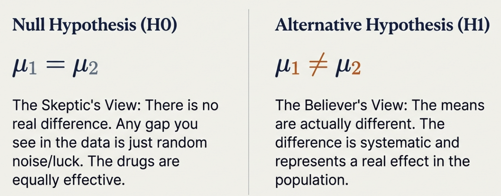
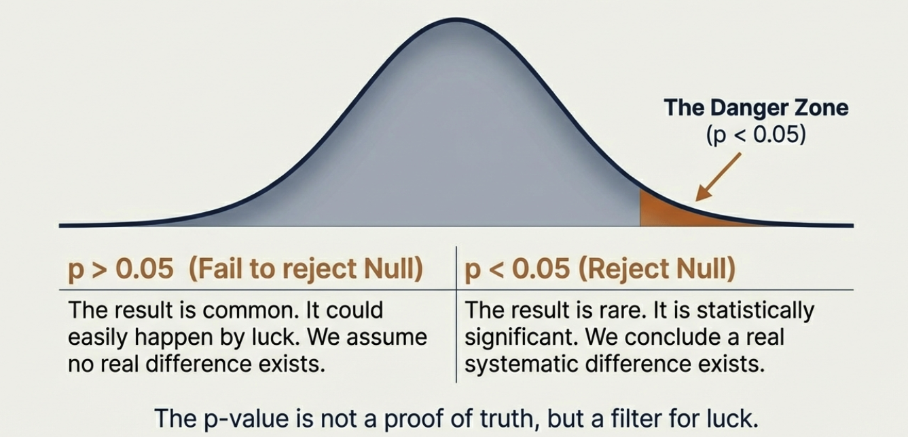
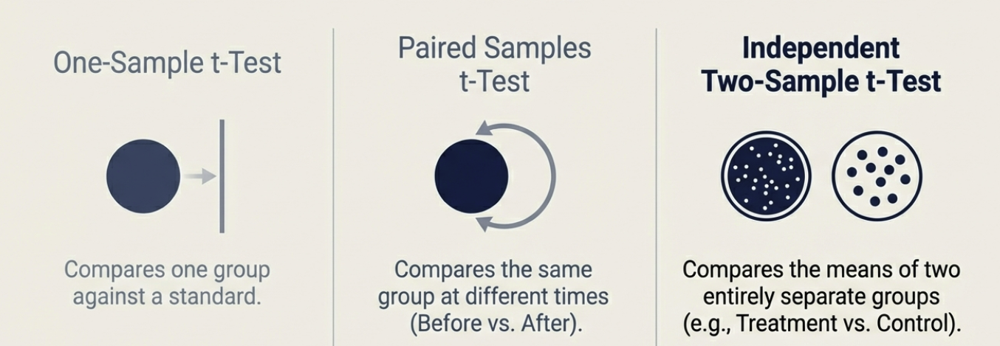
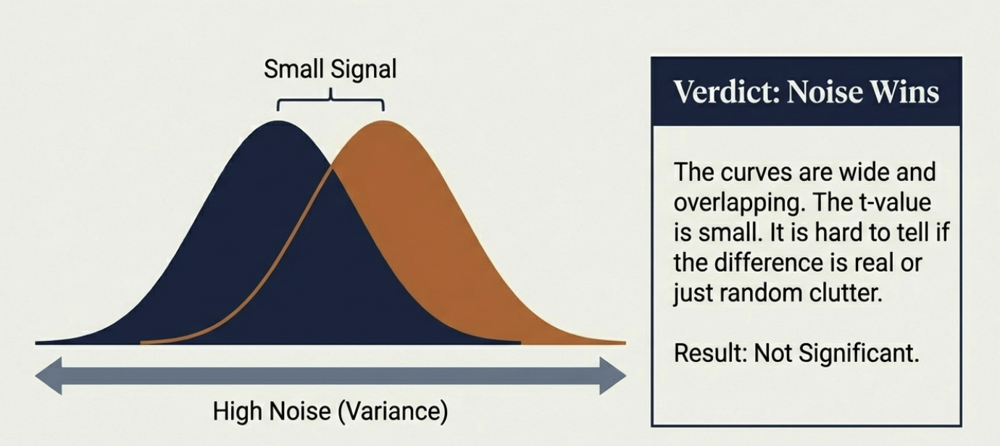
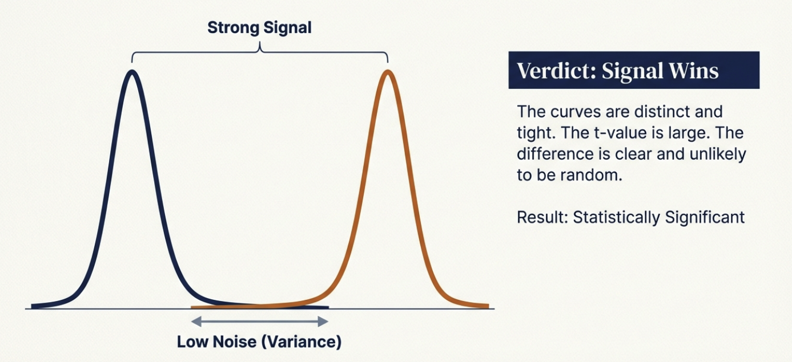
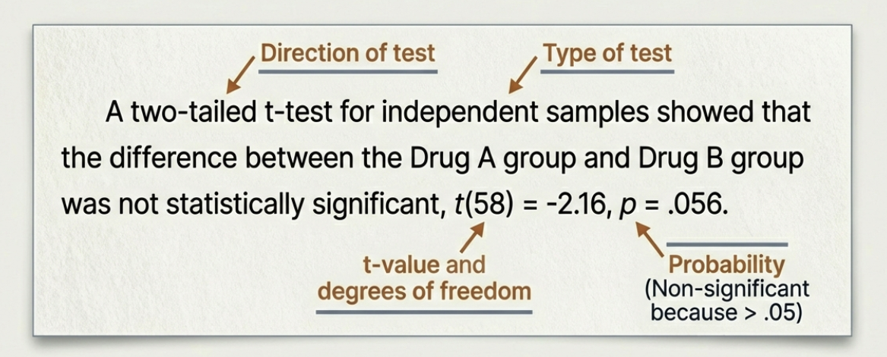
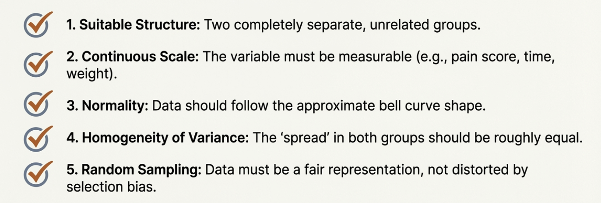

## Learning Outcomes

By the end of this lecture you will be able to:

-   Explain the logic of null hypothesis significance testing
-   Interpret p-values correctly (and avoid common misconceptions)
-   Understand confidence intervals as ranges of plausible values
-   Calculate and interpret Cohen's d
-   Choose and conduct independent vs paired t-tests
-   Report complete results in APA format

# Opening {background-color="#275882"}

## Return to Week 12

------------------------------------------------------------------------

## Remember the DataLab Results?

::: fragment
**Lab A (abstract words)**: M = 5.4 words recalled

**Lab B (concrete words)**: M = 6.8 words recalled

**Difference**: 1.4 words
:::

:::: fragment
::: poll-box
**The questions we need to answer**:

1.  Is this difference REAL, or just chance?
2.  How CERTAIN are we about these estimates?
3.  How BIG is this effect in practical terms?
:::
::::

------------------------------------------------------------------------

## The Three Questions

::: definition-box
Today we learn to answer:

1.  **Is it real?** → Hypothesis testing & p-values
2.  **How certain?** → Confidence intervals
3.  **How big?** → Effect sizes (Cohen's d)
:::

::: fragment
You need ALL THREE for your Research Report.
:::

# Act 1: The Logic of Testing {background-color="#275882"}

## NHST (\~25 min)

------------------------------------------------------------------------

## The Fundamental Question

When we observe a difference in our data...

::: fragment
**Is it a real effect, or just random chance?**
:::

:::: fragment
::: example-box
The 1.4 word difference could reflect:

-   A genuine effect of word type on memory
-   OR just random variation in who was in each lab
:::
::::

------------------------------------------------------------------------

## Null Hypothesis Significance Testing (NHST)

::: definition-box
**NHST**: A statistical framework that tests whether observed data are consistent with a null hypothesis of "no effect."
:::

::: fragment
We assume there's nothing going on, then ask: "How surprising is our data?"
:::

------------------------------------------------------------------------

## The Two Hypotheses

::::: columns
::: {.column width="50%"}
**Null Hypothesis (H₀)**

-   Assumes no effect/difference
-   The "skeptic's position"
-   What we test against

*"Word type has no effect on memory."*
:::

::: {.column width="50%"}
**Alternative Hypothesis (H₁)**

-   Assumes there IS an effect
-   The researcher's prediction
-   What we hope to support

*"Word type does affect memory."*
:::
:::::

## Summary

{fig-align="center"}

------------------------------------------------------------------------

## The Logic: Proof by Contradiction

::: incremental
1.  **Assume H₀ is true** (no real effect)
2.  **Calculate** how likely our data would be under H₀
3.  **If our data would be very unlikely**...
4.  **Reject H₀** and accept H₁
:::

:::: fragment
::: example-box
Like a court trial: Assume innocence (H₀) until evidence (data) proves guilt beyond reasonable doubt.
:::
::::

# Act 2: The p-value {background-color="#275882"}

## What It Really Means (\~20 min)

------------------------------------------------------------------------

## What is a p-value?

::: definition-box
**p-value**: The probability of obtaining results at least as extreme as those observed, **assuming the null hypothesis is true**.
:::

::: fragment
It answers: "If there were truly no effect, how often would we see data this extreme just by chance?"
:::

------------------------------------------------------------------------

## Example: Memory Data

::: example-box
If our memory comparison has **p = 0.03**, this means:

"If word type truly had no effect on memory, we would observe a difference this large (or larger) in only **3% of experiments**, just by chance."
:::

::: fragment
Because 3% is rare, we conclude H₀ is probably wrong.
:::

------------------------------------------------------------------------

## The Significance Threshold (α)

::: definition-box
**Alpha (α)**: The predetermined threshold for rejecting H₀. Conventionally set at **0.05 (5%)**.
:::

::: fragment
| p-value  | Decision                              |
|----------|---------------------------------------|
| p \< .05 | Reject H₀ ("significant")             |
| p ≥ .05  | Fail to reject H₀ ("not significant") |
:::

## A visual demonstration

{fig-align="center"}

------------------------------------------------------------------------

## What p-values Do NOT Mean

::: callout-warning
## Common Misconceptions

The p-value is **NOT**:

-   The probability that H₀ is true
-   The probability the results occurred by chance
-   The probability of replication
-   A measure of effect size
:::

::: fragment
A p-value only tells you how surprising your data would be IF H₀ were true.
:::

------------------------------------------------------------------------

## Type I and Type II Errors

|   | H₀ True | H₀ False |
|----|----|----|
| **Reject H₀** | Type I Error (false positive) | Correct! |
| **Fail to reject H₀** | Correct! | Type II Error (false negative) |

::: fragment
-   **Type I error rate** = α (usually .05)
-   **Type II error rate** = β (related to power)
:::

# BREAK {background-color="#EA8439"}

## 10 minutes

------------------------------------------------------------------------

# Act 3: How Big? How Certain? {background-color="#275882"}

## Effect Sizes & Confidence Intervals (\~25 min)

------------------------------------------------------------------------

## Beyond "Is There an Effect?"

::: callout-warning
## The Limitation of p-values

A p-value tells us IF an effect probably exists.

It does NOT tell us:

-   How BIG the effect is
-   How PRECISE our estimate is
:::

::: fragment
We need additional tools: **effect sizes** and **confidence intervals**.
:::

------------------------------------------------------------------------

## Effect Sizes: How Big?

::: definition-box
**Cohen's d**: A standardised measure of the difference between two means, expressed in standard deviation units.

$$d = \frac{\bar{X}_1 - \bar{X}_2}{s_{pooled}}$$
:::

::: fragment
**Key insight**: Effect sizes are independent of sample size. A tiny effect can be "significant" with huge n.
:::

------------------------------------------------------------------------

## Cohen's Benchmarks

| d value | Interpretation | Visual Overlap |
|---------|----------------|----------------|
| 0.2     | Small          | 85% overlap    |
| 0.5     | Medium         | 67% overlap    |
| 0.8     | Large          | 53% overlap    |

:::: fragment
::: callout-note
These are rough guidelines. Context matters! In some fields, d = 0.3 is impressive.
:::
::::

------------------------------------------------------------------------

## Visualising Effect Sizes

```{r}
#| label: effect-size-visual
#| fig-height: 4
#| fig-align: center
library(ggplot2)
library(tidyverse)

# Create data for overlapping distributions
x <- seq(-4, 6, length.out = 200)

effects <- tibble(
  x = rep(x, 3),
  d = rep(c("Small (d=0.2)", "Medium (d=0.5)", "Large (d=0.8)"), each = 200),
  d_val = rep(c(0.2, 0.5, 0.8), each = 200),
  y1 = dnorm(x, mean = 0, sd = 1),
  y2 = dnorm(x, mean = d_val, sd = 1)
)

effects |>
  ggplot() +
  geom_area(aes(x = x, y = y1), fill = "#275882", alpha = 0.5) +
  geom_area(aes(x = x, y = y2), fill = "#EA8439", alpha = 0.5) +
  facet_wrap(~d, ncol = 3) +
  labs(x = "Score", y = "Density",
       title = "What Different Effect Sizes Look Like",
       subtitle = "Blue = Control group, Orange = Treatment group") +
  theme_minimal(base_size = 14) +
  theme(axis.text.y = element_blank(),
        plot.title = element_text(hjust = 0.5, face = "bold"))
```

------------------------------------------------------------------------

## DataLab Example: Cohen's d

::: example-box
**Our memory data**:

-   Lab A: M = 5.4, SD = 1.8
-   Lab B: M = 6.8, SD = 2.0

$$d = \frac{6.8 - 5.4}{1.9} = \frac{1.4}{1.9} = 0.74$$

This is a **medium-to-large effect**.
:::

------------------------------------------------------------------------

## Confidence Intervals: How Certain?

::: definition-box
**Confidence Interval (CI)**: A range of values that is likely to contain the true population parameter.
:::

::: fragment
Instead of saying "the mean is 6.8", we say:

"The mean is 6.8, **95% CI \[6.07, 7.53\]**"

This shows our **precision**.
:::

------------------------------------------------------------------------

## Interpreting 95% CIs

::: callout-warning
## Common Misconception

A 95% CI does NOT mean "there's a 95% probability the true value is in this interval."
:::

:::: fragment
::: callout-tip
## Correct Interpretation

If we repeated this study many times and calculated a 95% CI each time, **95% of those intervals would contain the true value**.
:::
::::

------------------------------------------------------------------------

## CIs and Significance

::: definition-box
**The CI rule**: If the 95% CI for a difference **does not include zero**, the difference is statistically significant at p \< .05.
:::

::: fragment
```{r}
#| label: ci-plot
#| fig-height: 3
#| fig-align: center
ci_data <- tibble(
  comparison = c("Difference", "Zero"),
  mean = c(1.4, 0),
  lower = c(0.5, NA),
  upper = c(2.3, NA)
)

ggplot(ci_data, aes(x = mean, y = comparison)) +
  geom_point(data = filter(ci_data, comparison == "Difference"),
             size = 4, colour = "#EA8439") +
  geom_errorbarh(data = filter(ci_data, comparison == "Difference"),
                 aes(xmin = lower, xmax = upper), height = 0.2,
                 linewidth = 1.2, colour = "#EA8439") +
  geom_vline(xintercept = 0, linetype = "dashed", colour = "#275882", linewidth = 1) +
  annotate("text", x = 0, y = 2.3, label = "Zero (no difference)",
           colour = "#275882", size = 4, hjust = 0.5) +
  labs(x = "Difference in Words Recalled", y = NULL,
       title = "95% CI for the Difference Between Labs",
       subtitle = "CI doesn't include zero → significant difference") +
  theme_minimal(base_size = 14) +
  theme(plot.title = element_text(hjust = 0.5, face = "bold"))
```
:::

------------------------------------------------------------------------

## The Complete Picture

::: definition-box
**Report all three pieces**:

1.  **p-value**: Is the effect real?
2.  **Effect size (d)**: How big is it?
3.  **95% CI**: How precise is our estimate?
:::

::: fragment
**Example**: "The difference was significant, t(58) = 2.86, p = .006, d = 0.74, 95% CI \[0.42, 2.38\]"
:::

# Act 4: The t-tests {background-color="#275882"}

## Independent vs Paired (\~25 min)

------------------------------------------------------------------------

## Two Types of t-test

::: definition-box
**Independent samples t-test**: Compares means from **two different groups**

**Paired samples t-test**: Compares means from the **same people** measured twice
:::

::: fragment
The choice depends on your **design** (Week 13!).
:::

## One or Two Tailed

{fig-align="center"}

------------------------------------------------------------------------

## Independent t-test: When?

Use when you have:

::: incremental
-   Two separate groups of participants
-   Each participant in only ONE condition
-   Between-subjects design
:::

:::: fragment
::: example-box
**DataLab example**: Lab A (abstract) vs Lab B (concrete)

Different students in each lab → Independent t-test
:::
::::

------------------------------------------------------------------------

## Independent t-test: The Formula

$$t = \frac{\bar{X}_1 - \bar{X}_2}{SE_{difference}}$$

::: fragment
The t-statistic is the ratio of:

-   **Signal**: The difference between group means
-   **Noise**: The standard error of that difference

Larger t = more evidence against H₀
:::

------------------------------------------------------------------------

## Paired t-test: When?

Use when you have:

::: incremental
-   The same participants in both conditions
-   Each participant measured twice
-   Within-subjects design
:::

:::: fragment
::: example-box
**DataLab example**: Pre-session mood vs Post-session mood

Same students measured at both times → Paired t-test
:::
::::

------------------------------------------------------------------------

## Paired t-test: The Formula

$$t = \frac{\bar{D}}{SE_{\bar{D}}}$$

::: fragment
Where $\bar{D}$ is the **mean of the difference scores**.

We're testing: Is the average change within each person significantly different from zero?
:::

------------------------------------------------------------------------

## Why Paired Tests Are More Powerful

::: incremental
-   **Controls for individual differences**
-   Each person serves as their own control
-   Reduces "noise" in the data
-   Can detect smaller effects with same sample size
:::

:::: fragment
::: callout-tip
This is why Week 13's design decision matters! Within-subjects = more power.
:::
::::

------------------------------------------------------------------------

## The Design → Test Link (Recap)

| Your Design      | Data Structure         | Your Test          |
|------------------|------------------------|--------------------|
| Between-subjects | Two independent groups | Independent t-test |
| Within-subjects  | Paired scores          | Paired t-test      |

:::: fragment
::: callout-warning
Using the wrong test gives invalid results!
:::
::::

## In short

{fig-align="center"}

## Signal wins

{fig-align="center"}

# Closing: The Complete Picture {background-color="#275882"}

## APA Reporting (\~15 min)

------------------------------------------------------------------------

## What to Report

::: definition-box
**APA format for t-tests:**

t(df) = X.XX, p = .XXX, d = X.XX, 95% CI \[X.XX, X.XX\]
:::

::: fragment
**All five pieces**:

1.  Test statistic (t)
2.  Degrees of freedom (df)
3.  p-value (exact, unless p \< .001)
4.  Effect size (Cohen's d)
5.  Confidence interval
:::

------------------------------------------------------------------------

## Example: Independent t-test

::: example-box
"An independent samples t-test revealed that participants who studied concrete words (*M* = 6.8, *SD* = 2.0) recalled significantly more words than those who studied abstract words (*M* = 5.4, *SD* = 1.8), *t*(58) = 2.86, *p* = .006, *d* = 0.74, 95% CI \[0.42, 2.38\]."
:::

------------------------------------------------------------------------

## Example: Paired t-test

::: example-box
"A paired samples t-test showed that participants' mood ratings were significantly higher after the DataLab session (*M* = 6.5, *SD* = 1.4) compared to before (*M* = 5.3, *SD* = 1.6), *t*(29) = 3.64, *p* = .001, *d* = 0.67, 95% CI \[0.54, 1.86\]."
:::

## Another view

{fig-align="center"}

## In future

You will discuss assumptions...

{fig-align="center"}

------------------------------------------------------------------------

## Connection to Your Assessments

::: callout-important
## Research Report Requirements

Your Results section must include:

-   Descriptive statistics (M, SD) for each group/condition
-   The appropriate t-test (independent or paired)
-   Complete APA reporting: t, df, p, d, and 95% CI
-   Interpretation in words
:::

------------------------------------------------------------------------

## Key Takeaways

::: incremental
-   **NHST** tests whether data are consistent with "no effect"
-   **p-values** indicate probability of data given H₀ is true
-   **Effect sizes (d)** tell us HOW BIG the effect is
-   **Confidence intervals** tell us HOW CERTAIN we are
-   **Independent t-tests** for between-subjects designs
-   **Paired t-tests** for within-subjects designs
-   **Report all three**: p-value + effect size + CI
:::

------------------------------------------------------------------------

## Next Week

**Week 15: Correlation**

-   Relationships between continuous variables
-   Scatterplots and Pearson's r
-   Correlation ≠ causation
-   From correlation to regression

------------------------------------------------------------------------

## Questions?

::: r-fit-text
Questions?
:::

See you in the lab!