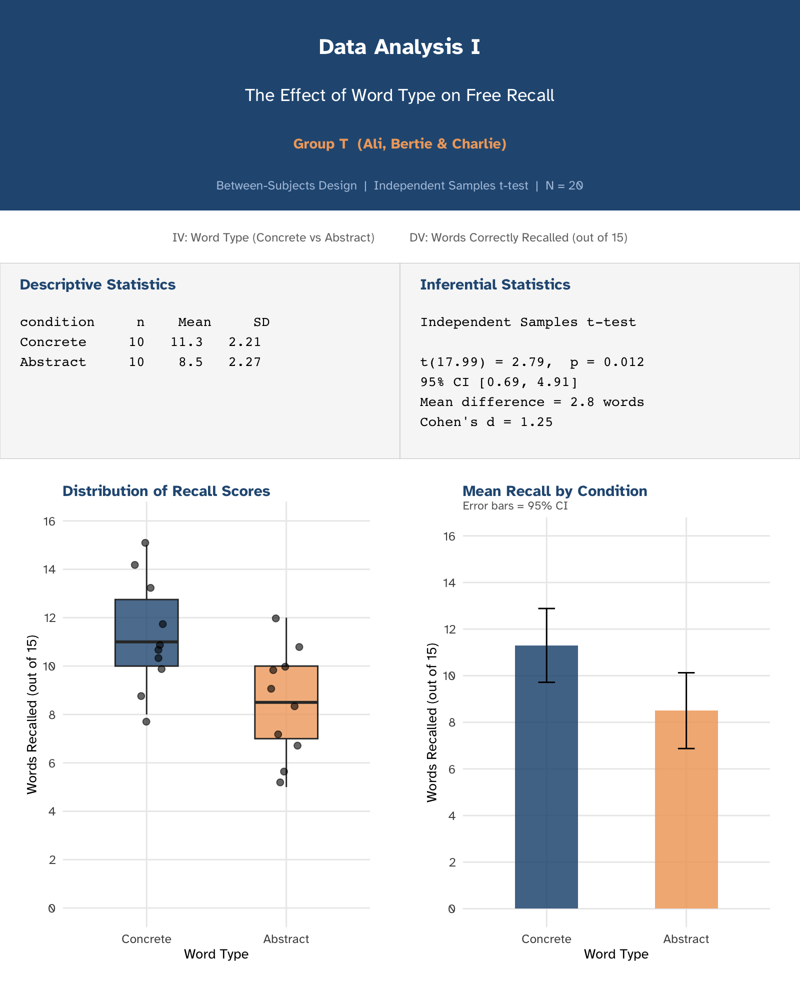
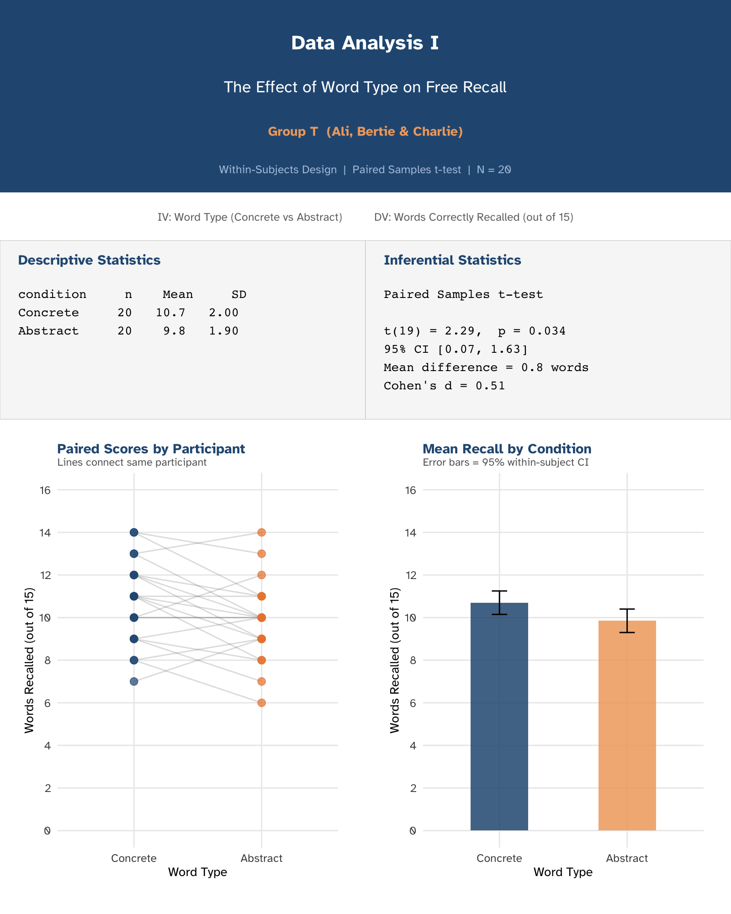

# The Road Ahead {background-color="#275882"}

## Where We Are and Where We're Going

---

## Your Four Assessments

| Assessment | Weight | Deadline | Status |
|---|---|---|---|
| **Research Plan** | 20% | Fri 27 Feb, 12 noon | **Due tomorrow!** |
| **MCQ Exam** | 20% | Wed 11 Mar, ~1 hour (in lecture) | Week 18 |
| **EDS Assignment** | 20% | Fri 20 Mar, 12 noon (~1-2 hours) | Week 19 |
| **Research Report** | 40% | Mid–late April, 12 noon | Post-Easter |

::: {.fragment}
::: {.callout-important}
## Research Plan
Your first submission is due **tomorrow at noon**. Make sure it's uploaded to Learn before you go to bed tonight.
:::
:::

---

## The Next 5 Weeks — What Happens When {.smaller}

| Week | Lab Focus | Milestone |
|------|-----------|-----------|
| **16 (now)** | Group formation, topic selection | Group registration |
| **17** | Finalising methodology | Methodology agreed |
| **18** | Finalising procedure, piloting with Gordon | Procedure complete |
| **19** | Data collection | Data collected |
| **20** | Write-up support | Report drafting begins |

::: {.fragment}
::: {.callout-note}
## Assessments During This Period
- **MCQ Exam** — Wed 11 Mar (~1 hour, in lecture)
- **EDS Assignment** — paper released on Monday, due Fri 20 Mar, 12 noon (~1-2 hours)
- **Research Report** — Mid–late April, 12 noon
:::
:::

---

## Your Group Project Timeline

::: {.definition-box}
**The group project feeds directly into your Research Report (40%).**

You work together to design and run a study. Then each person writes their own individual report.
:::

---

## What Your Group Does Together vs. Individually

:::: {.columns}

::: {.column width="50%"}
::: {.exercise-box}
**Together (Weeks 16–20)**

- Topic selection
- Literature review
- Design the study
- Create materials & procedure
- Collect data
- Review results
:::
:::

::: {.column width="50%"}
::: {.callout-warning}
## Individually

- Write your own 2,500-word Research Report
- Same data, **different reports**
- Do NOT share written drafts
- Sharing text = academic misconduct
:::
:::

::::

---

## What You'll Get Back: Data Analysis I — Between-Subjects

After your group collects data in **Week 19**, I'll run the analysis and return a one-page summary like this:

{width="75%" fig-align="center"}

---

## What You'll Get Back: Data Analysis I — Within-Subjects

{width="75%" fig-align="center"}

::: {.callout-tip}
## Your Job
You don't need to run the analysis yourself — I provide the output. Your Research Report interprets and discusses these results.
:::

---

## What You Need to Do This Week

::: {.step-1}
**Today (Thursday):** Form your group, choose your topic, find a key paper
:::

::: {.fragment}
::: {.step-2}
**Tomorrow (Friday 27 Feb, 12 noon):** Submit your Research Plan via Learn.Gold
:::
:::

::: {.fragment}
::: {.step-3}
**Next week onwards:** Work collaboratively to complete each week's milestones — see the projects documents on the VLE for more information.
:::
:::

::: {.fragment}
::: {.callout-note}
## OneDrive Group Folder
Each group will be given a shared folder on OneDrive. All project documents and materials must be submitted there.
:::
:::

---

# Today's Lab {background-color="#275882"}

## Group Formation & Topic Selection

---

## Today's Priorities

::: {.objectives-box}
**Two things matter today:**

1. **Form your project groups** (3–4 students)
2. **Choose your project topic** — from the example list or create your own
:::

---

## Lab Structure (~90 min)

| Time | Activity |
|------|----------|
| 10:00–10:15 | These slides + group formation |
| 10:15–10:30 | Topic selection, identify variables |
| 10:30–11:00 | Literature searching (PsycINFO + Google Scholar) |
| 11:00–11:30 | Evaluating sources + recording findings |
| 11:30–11:50 | Group discussion: hypothesis development |
| 11:50–12:00 | Wrap-up + next steps |

---

# Part 1: Group Formation {background-color="#275882"}

## Finding Your People (~15 min)

---

## Form Groups of 3–4

::: {.incremental}
- Look around — find 2–3 people to work with
- You'll work together for the **rest of the term**
- Data collection, methodology, procedure — all done as a group
- The **Research Report is individual** — you share data, not words
:::

::: {.fragment}
::: {.callout-warning}
## Group Allocation
Students not part of a registered group this week will be **allocated to a group on Monday of Week 17**.
:::
:::

---

## Once You've Formed a Group

::: {.exercise-box}
**Do these now:**

1. Exchange contact details (email / phone / WhatsApp)
2. Set up a group chat
3. Agree on how you're going to work together
4. Familiarise yourself with the weekly milestones
:::

---

## How Group Work → Individual Report

::: {.definition-box}
**Together:** Design study → Collect data → Share raw data

**Individually:** Write your own 2,500-word Research Report

Same data, different reports. Do NOT share written drafts.
:::

---

# Part 2: Topic Selection {background-color="#275882"}

## Choosing What You'll Investigate (~15 min)

---

## Choosing Your Topic

Each group needs a project topic. You can:

::: {.incremental}
- **Choose from the example list** in the project documents — these are ready-made topics with suggested variables
- **Adapt an example** — modify it slightly to suit your interests
- **Propose your own** — as long as it meets the key requirement below
:::

::: {.fragment}
::: {.callout-important}
## Key Requirement
Your topic must be testable using a **two-group t-test design** (between-subjects or within-subjects). Look at the project directory folder for guidance and examples.
:::
:::

---

## Identify Your Variables

::: {.exercise-box}
**As a group, confirm:**

- What is the **independent variable**? How many levels?
- What is the **dependent variable**? How is it measured?
- What **design** are you using? Between or within?
:::

::: {.fragment}
If you're unsure about any of these, ask your tutor now.
:::

---

# Part 3: Literature Searching {background-color="#275882"}

## Finding Relevant Research (~30 min)

---

## Starting Points

I've included some possible starting-point papers in your project documents — but they may not be the best fit for your specific topic.

::: {.fragment}
::: {.callout-tip}
## Do a Quick Search
A short literature search will often turn up papers that are more relevant, more recent, or a better methodological match than the supplied ones. Use them as a springboard, not the final word.
:::
:::

---

## Where to Search

::: {.definition-box}
**PsycINFO** (via Goldsmiths Library)

- Psychology-specific, peer-reviewed
- Best for targeted research

**Google Scholar** (scholar.google.com)

- Broader coverage, citation tracking
- Set up Goldsmiths Library Links for full-text access
:::

---

## Search Strategy

1. **Start with your key variables** as search terms
2. Use **Boolean operators**: AND, OR, NOT
3. Use **quotation marks** for exact phrases
4. **Filter** by date, peer-reviewed, English language

::: {.fragment}
::: {.example-box}
**Example:** If your topic is word concreteness and memory:

`"concrete words" AND "abstract words" AND recall`

`"word concreteness" AND memory AND "free recall"`
:::
:::

---

## What to Look For

::: {.incremental}
- **Peer-reviewed journal articles** — the gold standard
- **Recent papers** (last 10–15 years)
- **Highly cited classic papers** — foundational work everyone references
- **Review articles** — for broad overviews
:::

::: {.fragment}
**A single key paper that closely matches your topic is more valuable than three vaguely related ones.**
:::

---

## Reading Strategically

You do NOT need to read every paper word-for-word:

::: {.incremental}
1. **Abstract** — Is it relevant? What did they find?
2. **Introduction** — What's the argument? What other papers do they cite?
3. **Method** — Similar design to yours?
4. **Results** — Key findings and effect sizes
5. **Discussion** — Implications and limitations
:::

---

# Part 4: Building Your Reference List {background-color="#275882"}

## Keeping Track of What You Find (~30 min)

---

## An Average Report Contains 3–5 Papers (or More)

Your Research Report Introduction needs to build an argument from the literature. That typically means citing **3–5 quality sources**.

Keeping track of those from the start is a good skill — don't leave it until Easter to find your references again.

::: {.fragment}
::: {.callout-tip}
## Reference Manager
Install **Zotero** (free) — it saves references directly from your browser and formats them automatically.
:::
:::

---

## For Each Paper, Record

::: {.exercise-box}
1. **Full reference** (authors, year, title, journal)
2. **What they studied** (research question)
3. **How** (design, participants, key methods)
4. **What they found** (key results, effect sizes)
5. **Why it matters** for your project
:::

---

## How Many Sources?

For your Research Report Introduction:

- **3–5 quality sources** is a fair target
- Mix of **classic and recent** papers
- **Quality over quantity** — 3 well-integrated sources beat 10 listed without connection

---

# Part 5: Developing Your Hypothesis {background-color="#275882"}

## From Literature to Prediction (~20 min)

---

## Group Discussion

::: {.exercise-box}
**Discuss with your group:**

1. What does the literature suggest will happen?
2. What direction do you predict?
3. Is your hypothesis **one-tailed** (directional) or **two-tailed**?
4. What **theory** supports your prediction?
:::

---

## A Good Hypothesis

::: {.definition-box}
A hypothesis should be:

- **Specific** — names the IV, DV, and predicted direction
- **Testable** — can be confirmed or disconfirmed with data
- **Grounded** — based on previous research, not just a guess
:::

::: {.fragment}
::: {.example-box}
"Participants will recall significantly more concrete words than abstract words in a free recall task."
:::
:::

---

# Wrap-Up {background-color="#275882"}

---

## Before You Leave

::: {.callout-important}
## Checklist

- [ ] Formed a group (3–4 students) and exchanged contact details
- [ ] Identified your project topic (from list or your own)
- [ ] Searched for or found some relevant literature
- [ ] Started recording key findings from each source
- [ ] Discussed a provisional hypothesis with your group
:::

---

## Key Dates — Don't Forget

| When | What |
|------|------|
| **Tomorrow** Fri 27 Feb, 12 noon | Research Plan due via Learn |
| **Week 17** Thu 5 Mar | Group: finalise methodology |
| **Week 18** Wed 11 Mar | **MCQ Exam** (~1 hour, in lecture) |
| **Week 19** Fri 20 Mar, 12 noon | **EDS Assignment** due (~1 hour) |
| **Week 19** Thu 19 Mar | Group: **collect data** |
| **Week 20** Thu 26 Mar | Write-up support |
| **Mid–late April**, 12 noon | **Research Report** due |

---

# Questions? {background-color="#275882"}

## Then let's form groups and choose topics!

::: {.notes}
Circulate among groups to help with:

- Group formation for any students without a group
- Topic selection and scoping
- Search strategies on PsycINFO
- Evaluating source relevance

Note any students who haven't formed a group by the end — they'll need allocation on Monday.
:::
