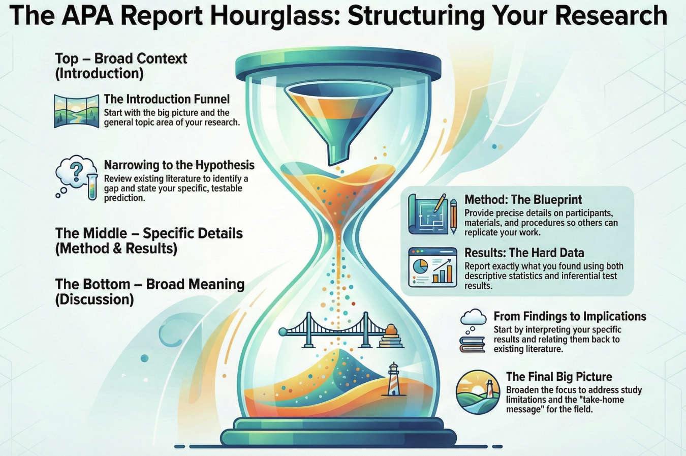

## Learning Outcomes

By the end of this lecture you will be able to:

-   Identify the sections of an APA-style lab report and their purpose
-   Understand how a Method section is structured (using your Research Plan as an example)
-   Apply APA writing conventions (tense, person, statistical notation)
-   Understand the Research Report and your group project

# Welcome Back {background-color="#275882"}

## After Reading Week

::: incremental
-   Welcome back from Reading Week
-   Hopefully you've been working on your **Research Plan**
-   Today: APA report format, how to write a Method section, and your group project
:::

:::: fragment
::: callout-important
## Research Plan Due This Friday

**Friday 27 February, 12 noon** — Submit via Learn.gold

[View the full assessment brief](../../assessments/assessment-handbook.qmd)
:::
::::

## Today's Plan

::: step-1
**Part 1**: The APA Lab Report — what goes where and why
:::

:::: fragment
::: step-2
**Part 2**: Writing a Method section — using your Research Plan as an example
:::
::::

:::: fragment
::: step-3
**Part 3**: APA writing conventions — the rules of the game
:::
::::

:::: fragment
::: step-4
**Part 4**: Your Research Report — a new study with your group
:::
::::

# Part 1: The APA Lab Report {background-color="#275882"}

## What Goes Where and Why

## Why Does Format Matter?

::: incremental
-   Psychology uses a **standardised format** for reporting research
-   Readers know exactly where to find information
-   Allows critical evaluation of methods and findings
-   You will use this format for your **Research Report** (due 1 April)
:::

:::: fragment
::: definition-box
**APA Format**: The publication style of the American Psychological Association. Used worldwide in psychology for journal articles, lab reports, and dissertations.
:::
::::

## The Sections of a Lab Report

::: example-box
Every APA lab report follows the same structure:

1.  **Title Page**
2.  **Abstract**
3.  **Introduction**
4.  **Method**
5.  **Results**
6.  **Discussion**
7.  **References**
:::

::: fragment
Think of it as telling a **story** — background, what you did, what you found, and what it means.
:::

## The Hourglass Shape

{width="800"}

## Details

::: {.fragment .smaller}
**Introduction** — Broad to narrow

-   Start with the big picture
-   Narrow to your specific study
-   End with your hypothesis
:::

::: {.fragment .smaller}
**Method & Results** — The narrow middle

-   Precise and specific
-   Exactly what you did and found
:::

::: {.fragment .smaller}
**Discussion** — Narrow to broad

-   Start with your findings
-   Broaden to implications
-   End with the big picture
:::

## When Will You Write Each Section?

| Section          | What it does            | When you'll write it |
|------------------|-------------------------|----------------------|
| **Title Page**   | Identifies the study    | Week 20 onwards      |
| **Abstract**     | \~150-word summary      | Write last           |
| **Introduction** | Background + hypothesis | Weeks 17-18          |
| **Method**       | What you did            | Weeks 17-18          |
| **Results**      | What you found          | Week 19-20           |
| **Discussion**   | What it means           | Week 20 onwards      |
| **References**   | Source list             | Throughout           |

:::: fragment
::: callout-tip
You don't write it all at once. We build it **section by section** over the coming weeks.
:::
::::

# Let's Walk Through Each Section {background-color="#275882"}

## Section 1: Title Page

::: definition-box
**Purpose**: Identify the study, the author, and the institution.
:::

::: incremental
-   **Title**: Concise and informative — include your key variables
-   **Your name** and student number
-   **Module code**: PS50008A
:::

:::: fragment
::: example-box
**Good title**: "The Effect of Word Type on Free Recall Performance"

**Bad title**: "My Psychology Experiment"
:::
::::

## Section 2: Abstract

::: definition-box
**Purpose**: A brief summary of the entire study (\~150 words). Written **last**.
:::

::: incremental
-   One or two sentences on **background/rationale**
-   One sentence on **method** (design, participants, task)
-   One or two sentences on **key results** (with statistics)
-   One sentence on **conclusion/implications**
:::

:::: fragment
::: callout-tip
## Pro Tip

Write the abstract after everything else. It's a summary, not a preview.
:::
::::

## Section 3: Introduction

::: definition-box
**Purpose**: Provide background, establish rationale, state your hypothesis.
:::

**The funnel structure:**

::: incremental
1.  **Broad context** — What is the general topic area?
2.  **Key research** — What have other researchers found?
3.  **Gap or question** — What hasn't been addressed?
4.  **Your study** — What are you investigating and why?
5.  **Hypothesis** — Your specific, testable prediction
:::

## Introduction: What NOT to Do

::: poll-box
**Which of these is a problem in an Introduction?**

A. Starting with a dictionary definition

B. Citing relevant research to build an argument

C. Including your results

D. Both A and C
:::

:::: fragment
::: callout-warning
**Answer: D** — Don't start with "The dictionary defines..." and never reveal your results in the Introduction. Build a logical argument from the literature.
:::
::::

## Section 4: Method

::: definition-box
**Purpose**: Describe what you did in enough detail that someone could **replicate** your study.
:::

:::: fragment
::: callout-tip
## Sound Familiar?

The Method section has four subsections — the same ones you've been writing in your Research Plan. Let's use your Research Plan as a worked example.
:::
::::

## Section 5: Results

::: definition-box
**Purpose**: Report what you found — descriptive and inferential statistics.
:::

::: incremental
-   **Descriptive statistics** — means, SDs (often in a table)
-   **Inferential test** — the t-test result with full APA notation
-   **Effect size** — Cohen's d with 95% confidence interval
-   **Brief verbal description** — what the numbers mean in words
:::

:::: fragment
::: callout-note
We'll cover Results reporting in detail in **Week 19**.
:::
::::

## Section 6: Discussion

::: definition-box
**Purpose**: Interpret your findings, acknowledge limitations, suggest future directions.
:::

::: incremental
1.  **Restate key findings** (in words, not statistics)
2.  **Interpret** — what do the results mean?
3.  **Relate to literature** — support or contradict previous research?
4.  **Limitations** — what could have been done differently?
5.  **Future directions** — what should researchers do next?
6.  **Conclusion** — take-home message
:::

:::: fragment
::: callout-note
We'll cover Discussion writing in detail in **Week 20**.
:::
::::

## Section 7: References

::: definition-box
**Purpose**: Full reference list in APA format for every source cited.
:::

::: example-box
**Journal article format:**

Walker, I., & Hulme, C. (1999). Concrete words are easier to recall than abstract words: Evidence for a semantic contribution to short-term serial recall. *Journal of Experimental Psychology: Learning, Memory, and Cognition*, *25*(5), 1256–1271.
:::

:::: fragment
::: callout-tip
Use a reference manager (e.g., Zotero — it's free!) to format references automatically.
:::
::::

# Part 2: Writing a Method Section {background-color="#275882"}

## Your Research Plan as a Worked Example

## The Key Insight

::: callout-important
## Your Research Plan Practises Method Writing

The Research Plan you're submitting this Friday is a **standalone assessment** on its own topic. But the skills are identical — it's structured exactly like a Method section.
:::

::: fragment
When you write your Research Report later (on a **different** topic, with your group), you'll use the same structure. Let's walk through it now.
:::

## Method Section Structure

| A Method section needs... | In your Research Plan... | In your Research Report... |
|-------------------------|-----------------------|-------------------------|
| Hypothesis | Your chosen topic | Your group project topic |
| Design + justification | **Design** subsection | **Design** subsection |
| Who takes part | **Participants** subsection | **Participants** subsection |
| What you use | **Materials** subsection | **Materials** subsection |
| Step-by-step process | **Procedure** subsection | **Procedure** subsection |
| Statistical test | Named + justified | Named + justified |

## Method Subsection 1: Design {.smaller}

::: example-box
**What to include:**

-   Type of design (between-subjects or within-subjects)
-   Independent variable and its levels
-   Dependent variable and how it's measured
:::

:::::::: fragment
::::::: columns
:::: {.column width="50%"}
::: con-box
**Weak:**

"We used a between-subjects design."
:::
::::

:::: {.column width="50%"}
::: pro-box
**Strong:**

"A between-subjects design was used. The independent variable was word type with two levels: concrete words and abstract words. The dependent variable was the number of words correctly recalled out of 15."
:::
::::
:::::::
::::::::

## Method Subsection 2: Participants

::: example-box
**What to include:**

-   Total number (and per condition if between-subjects)
-   Recruitment method
-   Key demographics (age range, mean age, gender)
-   Inclusion/exclusion criteria
:::

:::: fragment
::: pro-box
**Good example:**

"Twenty participants (15 female, 5 male; *M*~age~ = 21.3, *SD* = 2.1) were recruited via opportunity sampling from the student population at Goldsmiths, University of London. All were native English speakers aged 18 or over. Ten participants were randomly allocated to each condition."
:::
::::

## Method Subsection 3: Materials

::: example-box
**What to include:**

-   Stimuli (word lists, images, questionnaires)
-   How they were created or sourced
-   Key properties (e.g., word frequency, length)
-   Equipment used (if relevant)
:::

:::: fragment
::: pro-box
**Good example:**

"Two word lists were constructed, each containing 15 words. The concrete list contained words referring to physical objects (e.g., *hammer*, *bicycle*, *elephant*). The abstract list contained words referring to concepts or qualities (e.g., *freedom*, *honesty*, *courage*). Lists were matched for word frequency and syllable count."
:::
::::

## Method Subsection 4: Procedure

::: example-box
**What to include:**

-   Chronological account of what happened
-   What participants experienced step by step
-   Timing of each phase
-   Standardised instructions (summarised)
-   Ethical safeguards (consent, debrief)
:::

:::: fragment
::: pro-box
**Good example:**

"Participants were tested individually. After providing informed consent, they were presented with their assigned word list and given two minutes to study the words. The list was then removed and participants counted backwards from 100 for one minute as a distractor task. They were then given two minutes to write down as many words as they could recall, in any order. Finally, participants were debriefed and thanked."
:::
::::

## Common Method Mistakes

::: incremental
-   [Too vague]{.hl-red}: "Participants did a memory test" — what kind? How long? How scored?
-   [Including results]{.hl-red}: Method describes what you *did*, not what you *found*
-   [Missing justification]{.hl-red}: State your design AND explain *why* you chose it
-   [Wrong tense]{.hl-red}: Method uses **past tense** ("participants were asked...")
-   [Forgetting ethics]{.hl-red}: Always mention consent and debriefing
:::

## What Makes a Good Research Plan?

::: poll-box
**Your Research Plan will be assessed on:**

-   Clarity and appropriateness of hypothesis
-   Justification of design choices
-   Feasibility and detail of procedure
-   Appropriate selection and justification of statistical test
-   Overall coherence and scientific reasoning
:::

:::: fragment
::: callout-tip
The word **justify** keeps appearing. Don't just say *what* you'd do — explain *why*.
:::
::::

# Part 3: APA Writing Conventions {background-color="#275882"}

## The Rules of the Game

## Tense

::::::: columns
:::: {.column width="50%"}
**Past tense** — for what was done

::: example-box
-   "Participants **were** randomly allocated..."
-   "The study **used** a between-subjects design..."
-   "Results **showed** a significant difference..."
:::
::::

:::: {.column width="50%"}
**Present tense** — for established facts

::: example-box
-   "Research **suggests** that concrete words..."
-   "Dual coding theory **proposes** that..."
-   "The concreteness effect **is** well-documented..."
:::
::::
:::::::

## Person and Voice

::: incremental
-   **Third person** preferred in most sections
    -   "Participants were asked to..." *(not "I asked participants to...")*
    -   "The study aimed to..." *(not "We aimed to...")*
-   **Passive voice** is acceptable in Method and Results
    -   "Words were presented for two minutes"
-   **Active voice** for clarity when describing others' work
    -   "Walker and Hulme (1999) found that..."
:::

## Statistical Notation

::: definition-box
**Key rules:**

-   **Italicise** statistical symbols: *t*, *F*, *r*, *p*, *M*, *SD*, *d*, *n*, *N*
-   **Leading zero** for statistics that CAN exceed 1: *M* = 0.45
-   **No leading zero** for statistics that CANNOT exceed 1: *p* = .023, *r* = .72
:::

:::: fragment
::: example-box
**t-test result in APA format:**

*t*(18) = 2.45, *p* = .025, *d* = 0.87, 95% CI \[0.12, 1.61\]
:::
::::

## Reporting a t-test: Step by Step

::: step-1
**Step 1: Descriptives**

"The concrete word group recalled more words (*M* = 11.2, *SD* = 2.4) than the abstract word group (*M* = 8.7, *SD* = 2.1)."
:::

:::: fragment
::: step-2
**Step 2: Inferential test**

"An independent-samples t-test revealed a significant difference, *t*(18) = 2.48, *p* = .023."
:::
::::

:::: fragment
::: step-3
**Step 3: Effect size**

"The effect was large, *d* = 1.11, 95% CI \[0.17, 2.03\]."
:::
::::

## The Complete Results Paragraph

::: example-box
"Participants in the concrete word condition recalled significantly more words (*M* = 11.2, *SD* = 2.4) than those in the abstract word condition (*M* = 8.7, *SD* = 2.1). An independent-samples t-test confirmed this difference was statistically significant, *t*(18) = 2.48, *p* = .023, *d* = 1.11, 95% CI \[0.17, 2.03\]. This suggests that word concreteness has a large effect on free recall performance."
:::

:::: fragment
::: callout-note
You don't need to write results yet — but this is what you're building toward.
:::
::::

## Quick Reference: APA Checklist

::: exercise-box
**Before you submit anything, check:**

-   [ ] Past tense in Method and Results?
-   [ ] Third person throughout?
-   [ ] Statistical symbols italicised?
-   [ ] No leading zero before *p* and *r*?
-   [ ] Every claim supported by a citation or data?
-   [ ] Reference list matches in-text citations?
:::

# Part 4: Your Research Report {background-color="#275882"}

## A New Study With Your Group

## Two Assessments, Two Studies

::: callout-important
## Research Plan ≠ Research Report

These are **separate assessments** on **different topics**.

-   **Research Plan** (due this Friday) — your chosen topic (font/hydration/eye contact)
-   **Research Report** (due 1 April) — your **group project** topic (assigned in Thursday's lab)
:::

::: fragment
The Research Plan practises the skills. The Research Report applies them to real data you collect as a group.
:::

## Your Research Report

::: definition-box
**Assessment 4: Research Report**

-   **Due**: mid-late April
-   **Word count**: 2,500 words
-   **Format**: Individual APA-style lab report
-   **Weight**: 40% of module mark (double-weighted)
-   **Based on**: Your group project data (a **different** study from your Research Plan)
:::

::: fragment
[View the full assessment brief](../../assessments/assessment-handbook.qmd)
:::

## How It Works

::: incremental
1.  **Thursday's lab**: Form groups (3–4 students), receive your project topic
2.  **Weeks 17–18**: Design your study, find literature, develop methodology
3.  **Week 19**: Collect data as a group
4.  **Week 20**: Analyse data, begin writing
5.  **Easter**: Write your individual Research Report
6.  **mid-late April**: Submit
:::

## Individual Report, Group Data

::: callout-important
## Important

While data comes from your group project, the Research Report is an **individual** assessment. Each group member writes their own report independently.
:::

::: incremental
-   **Same data**, different reports
-   Your Introduction, interpretation, and evaluation should be your own
-   Do NOT copy from group members
-   Do NOT share written drafts
:::

## The Timeline

| When | What happens | What you'll write |
|------------------|-----------------------|--------------------------------|
| **Wk 16 (now)** | Form groups, receive topic, begin lit review | — |
| **Wk 17** | Finalise methodology and design | Introduction drafting |
| **Wk 18** | Develop procedure and materials | Method section |
| **Wk 19** | Collect data | Results section |
| **Wk 20** | Analyse data, report writing workshop | Discussion section |
| **Easter** | Individual write-up | Pull it all together |
| **Mid-late April** | Submit final report |  |

# Your Research Project {background-color="#275882"}

## Group Formation & What Happens Next

## Thursday's Lab

::: callout-important
## You MUST Attend Thursday's Lab

This is where you **form your project groups** (3-4 students).

If you do not attend and have not signalled your intent to participate, you will be **allocated to a group on Monday of Week 17**.
:::

## What Happens in the Lab

::: incremental
1.  **Form groups** — find 2-3 other people to work with
2.  **[Register your group](https://forms.office.com/Pages/ResponsePage.aspx?id=Px9DDcEgHEaVikaynU4CG8gqdkQ5QElOkXjIDHSz7DVURjBMUUo1TFNBUElCUEpGWVlZRzFSMDdYVy4u){target="_blank"}**
3.  **Identify your project topic** — one topic per group
4.  **Begin your literature review** — search PsycINFO and Google Scholar
5.  **Start generating a hypothesis** — based on what you find
6.  **Begin thinking about design** — how will you test it?
:::

## Project Timeline

| Week         | Group milestone                                    |
|--------------|----------------------------------------------------|
| **16 (now)** | Form groups, begin literature review               |
| **17**       | Finalise methodology and design                    |
| **18**       | Develop procedure and materials, submit documents  |
| **19**       | Collect data, upload data                          |
| **20**       | Receive results, begin write-up                    |
| Easter       | Individual report writing                          |
| **1 April**  | Research Report due                                |

# Summary {background-color="#275882"}

## Key Takeaways

::: incremental
-   APA reports follow a **standard structure**: Title, Abstract, Introduction, Method, Results, Discussion, References
-   Your Research Plan **practises Method writing** — the same structure applies to your Research Report (on a different topic)
-   Use **past tense** for Method/Results, **present tense** for established findings
-   **Italicise** statistical symbols; no leading zero for *p* and *r*
-   Your **Research Report** is a new study with your group — builds week by week
:::

## This Week's Priorities

::: step-1
**Wednesday (today)**: Understand APA format and Method section writing
:::

::: step-2
**Thursday (lab)**: Form your project group and begin literature review for your Research Report
:::

::: step-3
**Friday 12 noon**: Submit your Research Plan via Learn.gold
:::

## Questions?

::: r-fit-text
Questions?
:::

::: fragment
**Research Plan due Friday 27 February, 12 noon**
:::

Bence will see you in the lab on Thursday!