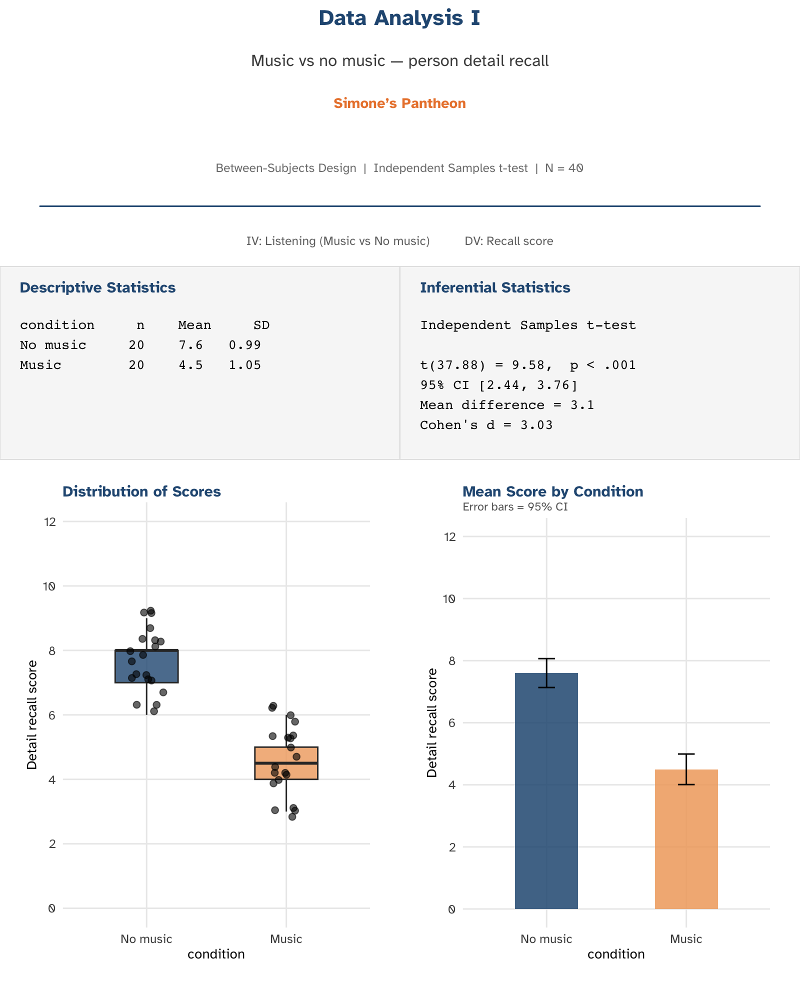
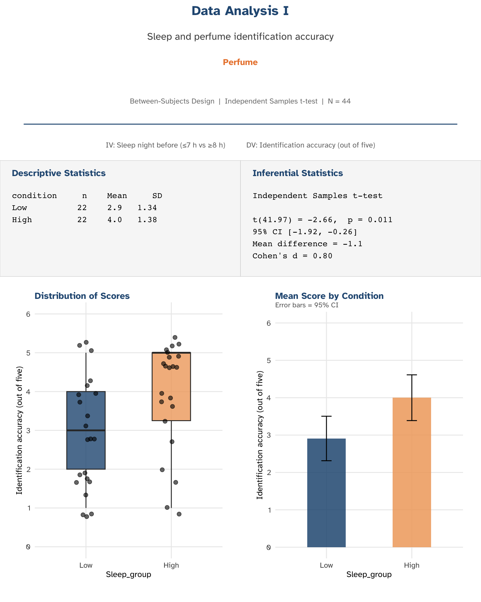
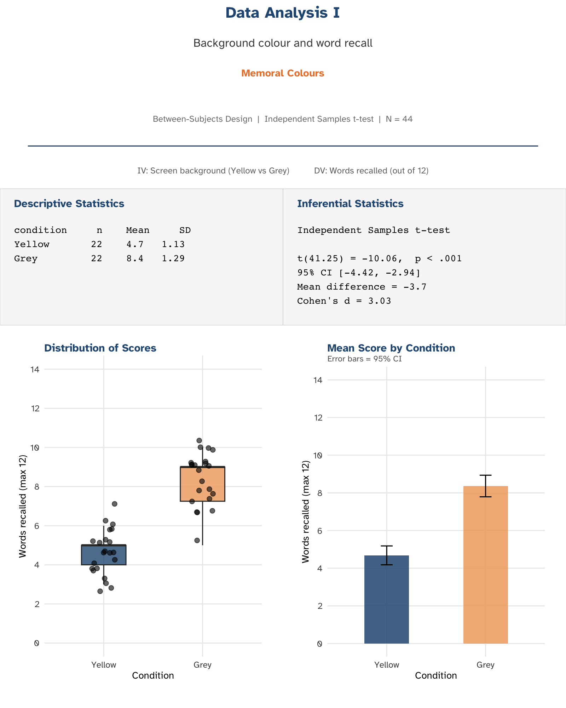
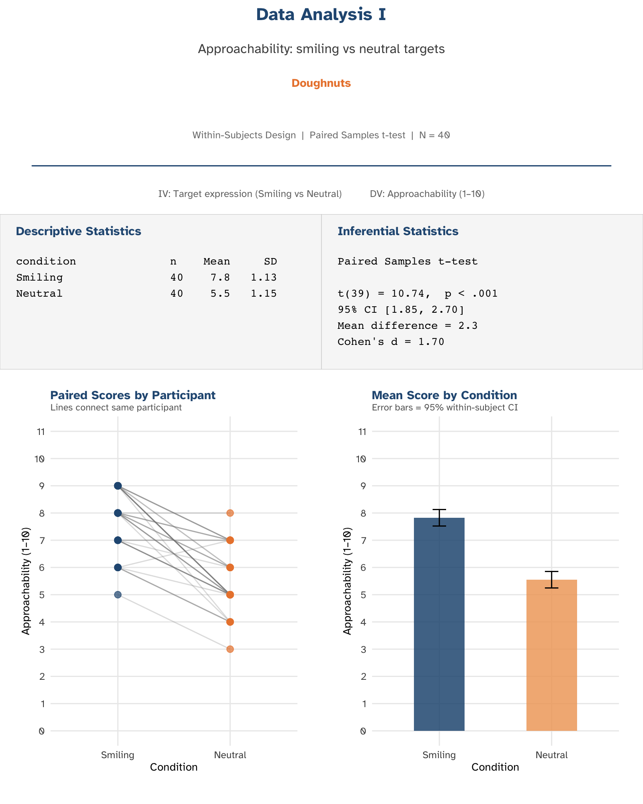
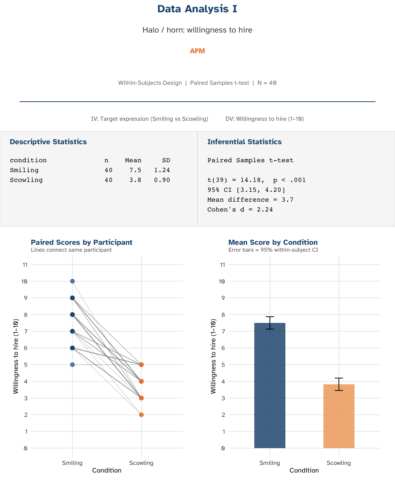

::: {.callout-important}
## Wednesday lecture — not running on campus
There is **no live lecture** this week. Use this page instead: it shows **preview images** of the analysis run on your group’s pooled data (Data Analysis I), plus **extra illustrative previews** (Simone’s Pantheon, Perfume, and three **project design examples** — Memoral Colours, Doughnuts, AFM) in the same layout. Use the numbers and plots here to help draft your **Results** section in APA format — see the **Thursday lab** materials for integration tips.
:::

## How to use these previews

Each image is a **static summary** (descriptive statistics, assumption checks where relevant, inferential test, and a simple plot). They are **starting points** for your write-up:

- Copy **M**, **SD**, *N*, test statistics, *p*-values, and effect sizes into your Results text (don’t screenshot the image as your only “result”).
- **Figures in your report** should be high quality (your own reproduction in R or equivalent), with a **Figure caption** below the figure (APA style).
- If anything looks unclear, bring questions to **lab** or **office hours**.

---

## Project groups (class returns)

### TedImoBea

{fig-alt="Summary of descriptive statistics, tests, and plot for group TedImoBea" width="100%"}

---

### JFKz Girlies

{fig-alt="Summary of descriptive statistics, tests, and plot for group JFKz Girlies" width="100%"}

---

### DNM

{fig-alt="Summary of descriptive statistics, tests, and plot for group DNM" width="100%"}

---

### The Boyz

::: {.callout-note collapse="true"}
## Design note
This study was **two independent groups** (not smiling vs smiling). The original spreadsheet used **one column per group** (wide format) rather than one row per participant — that’s fine for a first project; the preview analysis treats each column as a separate sample and uses an **independent samples** *t*-test.
:::

{fig-alt="Summary of descriptive statistics, tests, and plot for group The Boyz" width="100%"}

---

## Additional illustrative previews

These use the **same Data Analysis I layout** as your returns. They are **worked examples** for comparison (not a substitute for your own group’s write-up).

### Simone’s Pantheon

::: {.callout-note collapse="true"}
## Source
Music vs no music; **person detail recall**. Data supplied as a single-column spreadsheet — refreshed from `simones_pantheon.xlsx` when previews are built.
:::

{fig-alt="Summary of descriptive statistics, tests, and plot for Simone's Pantheon" width="100%"}

---

### Perfume

::: {.callout-note collapse="true"}
## Source
**Sleep** the night before (low vs high) and **identification accuracy (out of five)** — expanded teaching seed aligned with the module’s between-subjects workflow. Same statistical layout as the group previews.
:::

{fig-alt="Summary of descriptive statistics, tests, and plot for Perfume example" width="100%"}

---

### Memoral Colours

::: {.callout-note collapse="true"}
## Design
**Between-subjects:** Yellow vs **Grey** screen background; DV = **words recalled** (raw **0–12**). Seed expanded for teaching — **Grey** higher than Yellow on average.
:::

{fig-alt="Summary of descriptive statistics, tests, and plot for Memoral Colours" width="100%"}

---

### Doughnuts

::: {.callout-note collapse="true"}
## Design
**Within-subjects / paired:** **Smiling** vs **Neutral** target faces; DV = **approachability** (**1–10**).
:::

{fig-alt="Summary of descriptive statistics, tests, and plot for Doughnuts" width="100%"}

---

### AFM (Halo / horn)

::: {.callout-note collapse="true"}
## Design
**Within-subjects / paired:** **Smiling** vs **Scowling** targets; DV = **willingness to hire** (**1–10**).
:::

{fig-alt="Summary of descriptive statistics, tests, and plot for AFM" width="100%"}

---

## Next steps

- **Thursday lab**: integrating these outputs into APA-style Results paragraphs, module evaluation, and final Q&A.
- **Research Report**: continue with Method → Results → Introduction → Discussion → Abstract (see [Lab reading](lab/reading.qmd) and the [Project toolkit](../project/project-toolkit.qmd)).
